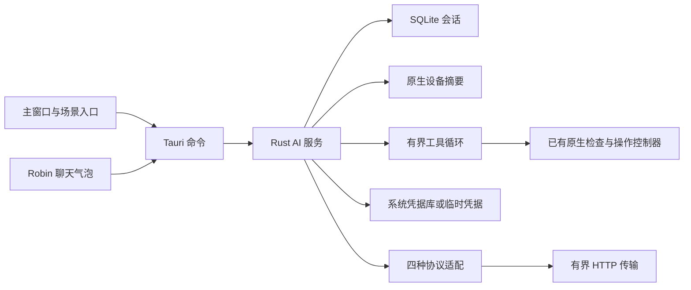

# CoreRobin AI 接入方案

更新：2026-09-08。仓库：`JimmyDaddy/CoreRobin-Internal`。本版按用户要求进行方案消融：保留用户自配服务、设备问答和共享会话所必需的结构，取消普通聊天的重复授权与非必要状态。代码消融及验证记录见 [消融试验](review/ai-ablation-2026-09-08.md)；此前实现和真实服务结果见 [首批实现记录](review/ai-first-delivery-2026-09-08.md)。随后按用户要求补入 [任务执行增量](ai-task-execution-design.md)，其验证独立记录。完整发布验收尚未完成。

## 1. 产品范围

用户配置自己的 Ollama 或云端模型服务，选定默认模型，然后直接聊天。CoreRobin 不提供官方 AI 中转、账号、订阅或统一额度。模型不参与监控采样、告警判定或本机诊断规则，服务失败不影响这些功能。

主窗口、场景入口和桌面 Robin 聊天气泡共享连接、会话与生成任务。新会话使用默认模型；已存在的会话保留自己的模型。配置一次即可使用，不逐轮选模型，也不因服务失败自动换到其他模型或云端。

设备上下文启用时，模型可按当前任务调用七项原生工具：当前设备状态、进程占用、已有历史、网络检查、常用目录扫描，以及需要用户确认的进程关闭和移入废纸篓。只有原生协议工具调用进入固定执行表；普通回答中的命令、JSON 或链接不执行。没有任意 Shell、任意文件内容读取、永久删除或后台自主任务。

## 2. 普通聊天只需一次发送动作

Enter 或“发送”直接发出本轮消息；Shift+Enter 换行；输入法组合期间 Enter/Esc 不触发发送或收起。设备上下文默认勾选，用户可取消或选择当前状态、网络检查、历史范围。打开页面、切换会话、重启应用和收到告警均不自动发送。

输入区展示当前连接、模型及服务地址。“查看发送内容”是用户主动选择的可选入口，展示原文、设备摘要、所选历史、缺失数据与真实接收地址；不作为发送前置步骤。不维护“记住授权”、授权摘要、授权缓存或撤销授权入口，也不扫描用户文字并通过启发式分类要求再次确认。

按发送键代表发送当前文字和所选上下文。用户手写的路径、网址等按原文发送；初始设备上下文来自原生聚合字段。输入区说明后续工具可能读取进程名称和文件占用信息并将结果发送到所选模型；取消设备上下文即关闭本轮设备工具。工具不读取文件正文或凭据；完整文件路径只保留在本机确认对象中。编辑连接地址不会把旧凭据自动带到新主机。

## 3. 最小运行结构

| 部分 | 唯一职责 | 不承担的内容 |
| --- | --- | --- |
| React 页面与共享 hook | 展示、输入、订阅状态、保存草稿 | 不持有第二份会话库，不直接请求模型 |
| Tauri 命令及 capability | 窗口权限、上下文清除协调、调用服务 | 不建立第二套字符串身份认证 |
| `AiService` | 连接版本、准备与启动、去重、取消、结果和存储协调 | 不接收窗口身份，不管理聊天授权账户或每日额度 |
| `ConversationStore` | SQLite 持久记录、事务、恢复和删除 | 不存储原始推理、模型凭据或发送授权 |
| `context` / `ai_context_bridge` | 从现有采样和记录构建有界设备摘要 | 不读取模型要求的任意路径、URL 或 SQL |
| `providers` / `transport` | 协议差异、请求、流解析、网络与大小边界 | 不自动换协议、换服务、重试生成 |
| `tools` / `ai_task_bridge` | 固定参数、任务目标引用、检查、确认与既有控制器调用 | 不提供任意命令、动态插件或第二套操作权限 |
| `credentials` | 系统凭据库与明确选择的临时凭据 | 不把密钥送入对话、日志或导出 |

保留独立 Robin 原生窗口：现有小鸟窗口不适合承载输入、长回复和历史。它与主窗读取同一个原生会话，不创建另一套聊天服务。

## 4. 连接与模型

一个连接记录地址、协议、认证方式、网络/代理配置和输出参数；模型选择只记录连接 ID 与模型 ID。支持 Ollama 原生、OpenAI Chat Completions、OpenAI Responses、Anthropic Messages 四种协议。DeepSeek 等兼容服务使用其实际提供的协议，厂商名称不代表支持全部接口。

新建会话只有一个默认模型规则；取消按场景分别维护的模型覆盖表。场景只决定设备上下文，避免同一用户从不同入口进入时意外切换接收方。已存在会话中的显式模型选择不变。

连接可离线保存、编辑、删除；模型列表失败仍可手填模型 ID。保存或刷新目录不发送真实诊断。连接文本测试由用户主动触发，只发送固定合成内容，不改变后续聊天格式。没有自动安装 Ollama、下载模型或擅自启动服务。

API Key、自定义认证头、Anthropic workspace、显式代理等属于兼容真实服务的配置，保留在连接设置中；不把它们混同于 CoreRobin 内部的聊天审批。AI 总开关仍是停止使用 AI 的产品控制；关闭后取消活动任务，保留本机历史供查看和删除。

## 5. 上下文和回答

当前状态使用原生采样和既有健康摘要；网络场景使用已经完成的检查；历史场景使用所选事件与实际记录范围。不自动开启记录或补造历史。用户发起检查任务后可调用网络探测和常用目录扫描，范围和实际结果显示在执行步骤中。缺数据、过期、传感器不可用和记录关闭应明确说明，并允许用户继续使用已有内容。

每轮只取预算内、仍可用于上下文的历史消息。输入、历史、输出和内存都有明确大小上限；上限用于防止应用失控，不采用任意每日请求数限制。服务商限流或计费错误按实际响应展示，应用不伪装成额度服务。

普通对话始终请求自然语言，除非用户在消息里主动要求数据格式。删除 Schema 测试按钮、格式强制参数和“能力测试成功后自动切换所有聊天格式”的状态耦合。已有结构化结果仍可查看；模型主动返回兼容结果时，只经过既有严格校验才显示结果卡。连接检查只记录地址、目录和文本结果，记录本身不控制聊天格式；旧 Schema 记录在读取时忽略。协议、流式和输出配置由连接版本涵盖，不重复存储。

结果卡只允许本机证据 ID、既有数值和固定页面目标。未知证据、额外测量、非法目标或不完整 JSON 不形成有效结果卡。模型文字不等于事实，不等于动作已执行。原始推理不展示；远程图片、原始 HTML 和任意 URI 不进入可执行界面。工具步骤显示本机结果；写操作只由原生生成目标及确认卡。

## 6. 状态、发送与并发

普通路径：用户发送 → 保存草稿/核对会话 → 原生准备 → 启动 → 接收 → 完成或失败。可选查看路径复用同一个冻结请求，不为预览维护另一套发送实现。

保留准备对象的必要原因是保证可选预览、设备证据、路由及实际请求一致。对象短期驻留内存，绑定会话版本、连接版本、统一请求代次和实际内容；过期或失效后重新准备。普通发送没有等待授权的独立业务状态。进程和文件修改另有原生步骤确认，绑定本次 requestId、stepId 和短期目标，明确拒绝后本任务不再请求其他修改。

只保留一个 `requestEpoch`，配置失效、来源清除、关闭 AI 和退出均使旧准备及在途回调失效。会话 `revision` 保护消息/上下文，`draftRevision` 防止另一窗口覆盖新草稿；它们保护不同对象，不合并为一个全局版本。

一次发送携带稳定 `submissionId`；同一提交返回已有 requestId，不重复请求模型。不同提交遇到正在运行的生成返回忙碌，不建立隐藏队列。写入用户消息、空助手消息和去重回执成功后才出站；崩溃后标记中断，不重新发送付费请求。

取消和收起窗口分开：停止生成取消请求并保留可见部分；收起只隐藏正文，已主动发起的请求可完成并保存。应用退出取消运行，迟到输出不能恢复已删除记录。

## 7. 窗口和本机记录

“在主窗口继续”携带同一 sessionId、草稿和消息位置；主窗确认可见且已加载后才收起气泡。主窗打开失败时气泡仍可用。鼠标移出、失焦和回复到达不自动收起或抢焦点。

会话默认保存在本机，用户可选择临时会话；历史分页读取。新模型不自动继承旧服务的对话：有消息时切换模型新建会话，旧记录保留。单会话删除与清空全部对话保留模型设置；清除全部本机数据同时清除 AI 配置和凭据。删除仍说明影响并确认，和普通发消息没有关联。

来源清除先阻止准备、使旧上下文失效、取消运行，再清理源记录。已保存的对话副本可保留并标记来源已清除，也可同时删除；清除失败显示回执。保留副本不表示后续继续把旧来源发给模型。多存储清除 gate 与失败恢复标记保护实际竞态，不作为聊天鉴权。

锁屏/会话切换隐藏正文；Windows/Linux/macOS 的原生焦点、输入法、锁屏和多屏行为仍需实机验证。浏览器 composition 测试不能代替 OS 输入法验收。

## 8. 保留的边界

Tauri capability 是窗口命令权限的唯一入口边界：主窗可配置凭据，气泡只能操作对话，桌面小鸟只能打开聊天。Rust 服务内部不再逐层传递 `main` / `robin-chat` 字符串重复鉴权。模型文字没有 IPC 执行入口；协议中的工具调用由 Rust 固定表校验并执行，气泡只有确认某个原生步骤的权限，不拥有进程或清理命令权限。

本机 loopback HTTP 强制直连；公网/局域网连接使用显式配置和 HTTPS。不跳过证书验证，不继承环境代理，不自动跟随跳转；阻止 metadata、link-local 和与目标类别不符的解析地址，避免凭据被重定向到其他接收方。Ollama 的本机地址不证明模型离线，已知云模型仍按实际处理位置显示。

系统凭据库操作不持有运行时锁等待；失败可重试或由用户选择临时凭据，不静默明文落盘。超时、输出上限、单个生成并发和存储预算继续保护监控应用的资源。

这些边界都对应具体失败模式；消融试验应验证其价值，不以减少行数为理由取消它们。

## 9. 本次删减与未来范围

删除普通聊天的二次确认、记住/撤销授权和授权指纹；删除自由文本启发式告警；合并重复失效代次；删除应用每日请求额度；取消场景模型覆盖；消除服务层窗口身份鉴权；精简重复能力字段；删除 Schema 强制及其能力测试耦合。取消与失效 helper 不再伪装成可能返回错误，真正的存储失败仍记录在会话/运行状态中。

不引入通用 Provider trait、任务 DAG、独立策略引擎、Node sidecar、模型账号系统或未来工具框架。四协议有实际格式差异，保留集中适配；状态订阅、错误展示、确认删除和结果卡组件有真实复用，保留小型共享组件。

本次只修改 Internal 中的方案与实现，不发布、不调整版本号、不改公开分发仓库。本次工具增量只覆盖已批准的固定范围；Gemini 原生协议、后台任务和任意工作流仍未实现。

## 10. 验收

1. 主窗口和气泡按 Enter/发送直接出站，默认设备上下文保持勾选；打开页面或历史不发送。
2. 可选查看内容不发送，取消不丢草稿；从查看页发送使用同一冻结内容。
3. 新会话统一使用默认模型；已有会话保留所选模型，不发生静默服务切换。
4. 同一提交去重，跨窗口草稿冲突可修复；取消、重启和窗口接续不重发请求。
5. 清除期间不能生成旧上下文；配置变化、来源清除、删除和退出后迟到输出无效。
6. 四协议正常结束、分片、拒绝、截断和推理隔离测试通过；普通请求均不注入 Schema，旧 Schema 测试记录不影响新对话；已有结果卡仍可读取。
7. 凭据不进入日志/对话，窗口最小 capability 与网络目标限制不回退。
8. 旧配置、模型、会话和草稿可继续读取；移除的授权/额度/场景覆盖不阻止升级。
9. 前端、原生、类型、lint、生产包体和主窗/气泡浏览器验收通过；测试数减少须说明是删除了哪个已废弃行为。
10. 使用用户已授权的 DeepSeek/Ollama 做少量合成回归；Windows/Linux 全应用及长期性能缺口仍如实保留。
11. 任务调用、结果回传、取消、去重、伪造目标拒绝、确认过期、持久化失败和重启不重做覆盖见任务执行验收。

## 11. 协议资料与验证边界

协议实现应参考服务商文档和真实响应：[Ollama](https://docs.ollama.com/api/introduction)、[OpenAI Responses](https://platform.openai.com/docs/api-reference/responses)、[OpenAI Chat Completions](https://platform.openai.com/docs/api-reference/chat)、[Anthropic Messages](https://docs.anthropic.com/en/api/messages)、[DeepSeek Responses](https://api-docs.deepseek.com/guides/responses_api/)、[DeepSeek Messages 兼容接口](https://api-docs.deepseek.com/guides/anthropic_api/)。

已经授权并完成的 DeepSeek/Ollama 合成验证不需要重复请求授权；新服务或未授权的真实数据使用另按用户指令处理。兼容服务测试不等于 OpenAI/Anthropic 官方账号验收；本地自动化不能替代 Windows/Linux 实机、真实 Ollama 冷启动或长期性能基准。
