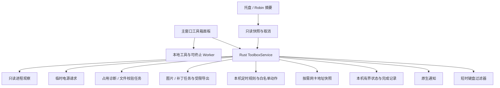

# CoreRobin 工具箱 v1：系统工具与本地工具实施方案

状态：上游 `@image-marker/web@0.1.0`、`bs-diff-patch-web@0.5.0` 已发布并完成本轮定向消费者验证；CoreRobin 工具箱尚未实施。全部约定功能统一实施、统一验收、一次交付；SDK 可用不代表桌面能力已交付。

日期：2026-08-31。适用仓库：`JimmyDaddy/CoreRobin-Internal`。

范围：原有十类工具，加上本次新增的正则解析诊断与可视化、颜色转换、定时任务、本机地址解析，以及 image-marker 和 bs-diff-patch 官网工具箱的已核实能力，共同组成一个完整交付，不拆成用户分批上线的功能。两个官网按实际工具逐项纳入，不把整个 React Native SDK 或 it-tools 全站自动纳入。本轮只更新设计及交接材料状态，不改动公开仓库和两个参考仓库，不在更新日志中提前宣传；第 5.6 节以正式发布包定义当前接入契约，原先的上游改造 Prompt 仅保留为历史记录。

## 1. 产品决策

CoreRobin 已能解释电脑状态和执行安全处置。新能力补足两种日常使用：用户交给 Robin 一个有期限的小委托，或者打开一个工具马上处理手头的文本、文件。

- 统一入口叫“工具箱”，内部按“系统与网络、文本与开发、图片、文件与补丁”分类，不新增一排一级导航；原有系统工具/本地工具划分保留为执行与权限边界。
- 保活与进程提醒由独立 Rust 服务执行；关闭窗口、WebView 重载、暂停资源监控不终止它们。
- 本地工具默认离线，普通输入仅在当前页面内存处理；不读取剪贴板、不自动保存输入、不执行输入中的代码或网址。图片/补丁批处理的受控临时产物与用户明确保存的定时规则是必要例外，具体字段和清除规则见第 5.4、5.5、6.3、11 节。
- 工具按需加载，托盘和 Robin 小窗口只加载摘要，不加载工具编辑器或计算依赖。
- 本地工具覆盖原有六张卡片以及正则、颜色、图片处理、差异与补丁；相同 SHA-256 能力合并，不因来源不同重复提供入口。官网工具的准确映射见第 5.4、5.5 节。
- 扩展后的全部约定能力在同一交付中完成，支持平台的实机与安全验收一起通过后再宣告交付完成。Windows 整卷占用诊断、Linux 键盘清洁仍是明确的平台范围限制，不伪装成已支持。
- 不做通用自动化引擎、脚本执行、后台限速、单应用断网、合盖保活、自动关机、自动强杀和强制卸载卷。
- 本次只修改方案；第 12 节的工作包用于内部并行分工，不对应分期发布。任何约定范围内的能力尚未实现或未通过验收，都不能通过隐藏入口、关闭 capability 或挪到后续版本把工具箱标成完成；不混入其他任务的工作区改动。

## 2. 当前架构依据

以下为本次源码静态核查结果，不代表重新完成三平台实机验证。

| 已有基础 | 接入位置 | 设计影响 |
| --- | --- | --- |
| 日常“帮我解决”、专业导航、Robin 和托盘 | `src/appNavigation.ts`、`src/components/DailySolve.tsx`、`src/components/TrayPanel.tsx`、`src/components/RobinCompanionWindow.tsx` | 共用主窗口工具箱面板；不复制三套业务逻辑 |
| 原生采样与 AppState | `src-tauri/src/lib.rs`、`sampler_service.rs` | 采样可暂停且后台不一定有完整进程列表，不能作为进程观察的唯一来源 |
| 进程身份与动作租约 | `models.rs` 的 `ProcessKey`、`identity.rs`、`process_control.rs` | 复用 PID/birth token 等身份原语；60 秒、一次性控制租约不能用于长期观察 |
| 原生通知 | `background_supervisor.rs` | 复用投递设施；工具箱通知不依赖主 WebView 存活 |
| 多窗口状态同步 | `health_state.rs`、`src/hooks/useSharedHealthState.ts` | 复用“先订阅、再读取、按 revision 去旧”的协议模式；另设工具箱状态，不塞进健康事件 |
| 文件扫描、SHA-256、安全存储 | `file_insights.rs`、`safe_fs.rs`、`private_storage.rs`；Cargo 已有 `sha2` | 文件校验使用独立流式读取任务，不触发整盘扫描 |
| 卷推出 | `user_actions.rs`、`lib.rs` | 现有 mountPoint 不足以绑定同一块盘；诊断后重试需要新增稳定卷身份 |
| 隐私中心、操作记录、国际化 | `SettingsExplorer.tsx`、`userActionHistory.ts`、`src/i18n/` | 新数据纳入清理范围；不把工具原文写入现有历史或通知 |
| 网卡地址与接口详情 | `models.rs:316`、`monitor.rs:196`、`src/types.ts:676`、`NetworkExplorer.tsx:1280` | 已有 IP/CIDR、MAC、MTU、接口状态；新增解释和聚合展示，复用采集原语，不另写 shell 版 ifconfig |

目录增长排行榜、重复文件、网络质量诊断和隐私中心已经存在，不计入本次新功能。

## 3. it-tools 的参考边界

核查仓库：[CorentinTh/it-tools](https://github.com/CorentinTh/it-tools)，源码快照 `d505845f918e946ec300af7b36efc107e2f66e9e`。未安装依赖或运行上游项目。

上游使用 Vue 3、TypeScript、Vite、Naive UI、VueUse 和 Pinia；本项目使用 React/Tauri，不能直接把 Vue 页面作为 React 组件接入。上游 [LICENSE](https://github.com/CorentinTh/it-tools/blob/d505845f918e946ec300af7b36efc107e2f66e9e/LICENSE) 与 README 标注 GNU GPLv3。

本方案的默认路径是参考功能输入输出和使用场景，依据公开标准、CoreRobin 自主需求及另行审核许可的基础库实现。**不复制上游源码、模板、文案、测试数据，不逐句翻译 Vue 组件，不打包或 iframe 嵌入上游站点。** 若未来希望采用具体上游材料，必须重新审查授权与分发义务，不能用“换了框架”或“保留署名”替代许可评估。这里记录工程选择，不作法律结论。

上游与拟新增能力的区别必须保留：

- 上游 `hash-text` 是文本散列；桌面文件 SHA-256 需要我们新增流式任务。
- 上游随机端口工具只生成数字，不检测空闲、不保留端口；本机端口占用检测需要另接 CoreRobin 原生连接能力。
- JWT 解析不验证签名；cron 解释不等于创建或可靠执行定时任务。
- 上游部分工具把原文写入 Storage 或查询参数，另有可配置统计代码；不沿用这些数据策略，也不宣称整个上游站点绝无网络行为。

## 4. 入口和交互

### 4.1 一个主窗口面板

新增 `ToolboxPanel`，主窗口内以可扩展面板呈现，不创建带全套权限的新 WebView。窗口较窄时占据内容区，较宽时保留两列。日常与专业模式共用组件。

入口：

- 日常模式：“帮我解决”下增加“工具箱”，首页仅在有活动委托时出现一条摘要。
- 专业模式：顶部工具按钮打开面板；进程详情增加“退出时提醒我”；卷推出失败增加“查找使用者”。
- 托盘：显示“正在看护 2 项”和“打开工具箱”；可直接取消指定看护。创建任务与敏感操作仍进入主窗口。
- Robin：展开后显示一条任务摘要和入口，不因任务完成不断弹出、抢焦点。第一版不加入全桌面拖放捕获。

面板结构：

```text
工具箱                                          关闭
搜索功能名称…      系统与网络 | 文本与开发 | 图片 | 文件与补丁

正在进行（有任务时才出现）
  防止闲置休眠        剩余 42 分钟                结束
  等待选定进程退出    剩余 3 小时                 查看

系统与网络                  文本与开发
  限时保活 / 进程退出提醒      JSON / URL / Base64 / 时间 / UUID
  文件使用者 / 键盘清洁        正则诊断与可视化 / 颜色 / 二维码
  定时任务 / 本机地址

图片                        文件与补丁
  图片工具组                  SHA-256 / 差异与补丁工具组

最近完成（最多 5 条，可进入记录）
```

搜索只匹配工具名称、别名和描述，不搜索用户输入；仅持久保存收藏的工具 ID 与非敏感选项。第一版不做全局快捷键、命令启动器、任意插件或工具链自动串联。

### 4.2 一致的工具页面

工具页提供标题、返回、输入、显式执行按钮、结果、复制、清空；需要时增加选择文件、保存副本。输入与结果视觉区分，不自动覆盖输入。

- 默认空白，可以主动载入不含真实信息的示例。
- 切换工具、关闭面板时清空原文和结果；返回不恢复敏感输入。文件 hash、图片与补丁计算不转入无人知晓的后台会话：离开工具时请求取消，确认工作任务停止后释放结果；若停止尚未确认，主窗口保留“正在停止处理”的状态与停止入口，不假报结束。新页面以 jobId/页面 generation 拒绝旧结果回填。明确保存的定时任务独立运行，不因离开编辑页而取消。
- 不自动读取或改写剪贴板，复制必须点击；不承诺复制后的内容能从系统剪贴板历史中撤回。
- 解码结果按纯文本显示，不用 HTML 渲染，不自动打开链接，不运行表达式。
- 不支持的平台显示具体原因和可行替代入口，不做一个点击后才报错的“可用”按钮。

## 5. 本地工具完整交付规格

| 工具 | 本次输入与输出 | 必须保留的边界 |
| --- | --- | --- |
| JSON | 严格 JSON → 校验、错误行列、2/4 空格格式化、压缩 | 不接受 JSON5，不默认排序键；保留大整数、原始数字文本和键顺序，不用 `JSON.parse` 后直接 stringify 导致精度变化；重复键给提示，不擅自合并 |
| URL / Base64 | URL 参数百分号编码/解码；完整 URL 结构查看；UTF-8 文本与 Base64/Base64URL 转换 | 模式显式选择，重复 query key 保留；区分 `+` 与空格规则；非法 `%`、padding 或 UTF-8 给错误，不静默替换；二进制文件 Base64 不属于本次文本编解码范围 |
| 时间转换 | Unix 秒、毫秒、带时区 ISO 字符串双向转换；并列显示 UTC 与当前本地时区 | 单位由用户选择，不只按位数猜；拒绝越界、模糊日期与无时区字符串；显示所用时区，不用“现在”覆盖用户输入 |
| UUID | 生成 UUID v4，一次 1–100 个，复制单个或整组 | 使用系统安全随机来源；不把 UUID 当密码；不提供 v1 等可能带额外身份信息的版本 |
| 二维码 | 文本/URL；手填 Wi-Fi SSID、密码、开放网络/WPA-WPA2；预览、保存 PNG | 不读取钥匙串或当前 Wi-Fi 密码；Wi-Fi 二维码包含凭据，保存前明确提示；不支持企业 EAP、远程图片、外链 logo 或 SVG 导出 |
| SHA-256 | UTF-8 文本或一个用户选定的普通本地文件 → 十六进制摘要；可粘贴期望值比较 | 文件流式读取、进度和取消；不整文件进入 WebView；读取中变化不显示“校验通过”；摘要匹配不代表发行者可信或已验证签名 |

实现选择：

- URL、编码、UUID 和基础时间处理优先使用标准 API，按 [RFC 4648](https://www.rfc-editor.org/rfc/rfc4648) 等定义格式行为。
- JSON 按 [RFC 8259](https://www.rfc-editor.org/rfc/rfc8259) 校验。可评估 `jsonc-parser` 的严格配置和保留原文的格式化 edits；不得因为基础库支持 comments 就自动放开 JSON5/JSONC。最终依赖与版本在实施时审核。
- 二维码可评估独立的 `qrcode` 库，审核其选定版本许可、浏览器构建和传递依赖；不引入 it-tools 的依赖全集。
- SHA-256 复用当前 `sha2` 依赖，新增用户选定文件的只读工作任务；不把清理扫描缓存变成工具输入数据库。

### 5.1 有界计算

初始限制是实施验收预算，达不到时收紧产品限制，不能无限提升后台资源消耗：

| 项目 | 初始上限 / 行为 |
| --- | --- |
| JSON、编码和文本 SHA-256 | 输入最多 1 MiB UTF-8；结果最多 4 MiB；JSON 深度最多 128 |
| QR 载荷 | 最多 2 KiB，仍需满足所选 QR 容量；默认黑白；超限解释，不静默截断 |
| 计算任务 | 显式执行；重任务使用可终止 Web Worker；前台重计算全局一次最多 1 项；基础文本/正则 2 秒上限，图片/补丁按第 5.4、5.5 节独立预算，不套用文本预算 |
| 原生文件 SHA-256 | 一次最多 1 文件，1 MiB 缓冲流式处理；取消后通常 1 秒内停止，慢设备不能阻塞主线程；多文件工具仅持其声明所需的有限 token，不放开任意路径读权限 |
| UI / 结果刷新 | 进度最多每秒 4 次；大结果只显示有界预览，复制/导出前仍检查总量 |
| 工具关闭 | 终止 Worker、释放对象 URL 和文件句柄、丢弃输入引用；不宣称能保证操作系统层面的安全擦除 |

文件 hash 读取开始时绑定文件身份，结束时复验大小、身份与可用的变更标记；变化、权限错误、取消是独立状态。只接受用户主动选择的普通文件，不跟随替换后的路径、不自动读取设备节点、管道或整目录。允许多个 GiB 的文件，但必须在大文件与慢盘样本上验证内存有界。

### 5.2 正则解析、诊断与可视化

输入正则和测试文本，提供语法错误位置、逐段中文解释、匹配高亮、捕获组/命名组、匹配区间、替换预览，以及可缩放的结构图。点图中的分组、分支、重复节点，高亮对应表达式；无障碍模式提供同内容的文本树。替换只接受文本模板，不接受 JavaScript 回调。

实现分为语法解析、结构图和实际匹配三部分。可评估 `@eslint-community/regexpp` 生成 AST，自行实现图形和说明；实际匹配使用隔离 Worker 中的 JavaScript RegExp，明确标注 ECMAScript 方言与当前引擎支持范围。解析器能理解但当前 WebView 不支持的语法，只能查看结构，不能伪称已完成匹配；不宣称等同 PCRE、Python、Java 或 Rust 正则。

- 结构图解释语法关系，不冒充正则引擎真实的逐步回溯轨迹。静态诊断可提示嵌套重复、空匹配等风险，但不能证明“没有 ReDoS 风险”。
- 表达式最多 16 KiB，测试文本最多 256 KiB，匹配最多 1000 项、捕获结果总量最多 4 MiB；AST 最多 2000 节点、深度 64。零长度匹配按 Unicode 模式正确推进，避免死循环。
- 解析和匹配均有独立可终止 Worker；单次 2 秒上限，取消或超时从外部终止 Worker。不能靠同一个被阻塞线程上的定时器取消灾难性回溯，也不能因图形功能而取消运行上限。
- 图中标签、匹配文本和替换结果只以安全文本渲染。图仅在应用内显示，本次不新增接受任意 SVG/HTML 的导入导出接口。
- 模板随应用打包，选择后可编辑；用户自己的表达式和测试样本默认不保存，不通过 AI 或远程服务解释。

### 5.3 颜色转换

一张卡片支持 HEX/HEXA、RGB/RGBA、HSL/HSLA、HSV、OKLCH 和 `color(display-p3 …)` 双向转换，包含透明度、色块、明暗背景预览和逐格式复制。识别 CSS 命名色；HSV 是工具输入格式，不伪称 CSS 原生函数。

- 颜色运算以明确颜色空间和浮点值为准，只在输出时按格式舍入；HEX 为 sRGB，alpha 不丢失。无色相的灰色明确表示，不输出 NaN。
- 超出 sRGB 色域时同时展示原颜色值与“映射到 sRGB”的近似结果，并提示颜色可能变化，不把截断后的 HEX 称为无损转换。屏幕预览受 WebView、系统色彩管理和显示器影响。
- 本次不做 CMYK/印刷 ICC 转换、屏幕全局取色或自动读取剪贴板；这些需要不同的色彩与系统权限契约。
- 可评估 Color.js 按需模块，依据 CSS Color 4 校验数值与色域处理；不加载远程色板或字体。限制单个输入 4 KiB，非法值明确报错。

### 5.4 image-marker 官网工具能力

功能范围最初依据 `/Users/jimmydaddy/study/react-native-image-marker-bug-fix` 的源码快照 `719ec86a2de33c70956650c70cc194f58cc8e5d1` 核定：9 个工具页与 1 个图层编辑器演示，配置网址为 [中文工具箱](https://image-marker.corerobin.com/zh-cn/tools/)。本轮复核时上游工作区干净，HEAD 为 `e476656dc37651b2d3e16dc3da32805e2784baea`；SDK 消费依据正式 npm `@image-marker/web@0.1.0`，不依赖该本机路径或假定 HEAD 就是发布包来源。下表保留已约定范围，未重新验收官网线上交互或 Tauri 实机。

| 官网入口 | 纳入 CoreRobin 的具体能力 | 必须说明的边界 |
| --- | --- | --- |
| 图片加水印 | 文字、位置、透明度、字号、旋转、描边、单个/平铺；PNG/JPEG 导出 | 官网图片水印使用内置示例 Logo；桌面接入补用户自选本地 Logo，不承诺任意远端素材 |
| 批量加水印 | 同一水印配置处理多图、进度、取消、ZIP 导出 | 串行/有界处理，不把所有原图、结果和 ZIP 同时留在内存 |
| 保密水印 | 保密/仅供内部等模板和自定义文字覆盖 | 并入水印页的预设，不重复一套渲染引擎 |
| Recipe 构建器 | JSON 编辑、校验、版本迁移、预览、导出 JSON、复制调用代码 | 高级子页；复制代码但不执行；资源只允许明确授权的本地素材 |
| 图层编辑器 | 选择/多选、移动、缩放、旋转、复制、分组、对齐、排序、隐藏、锁定、撤销/重做和渲染 | 最初调研的官网为固定背景/Logo 演示；桌面补本地素材选择和文字编辑使其可实际使用，不宣称拥有完整专业修图能力 |
| 隐形水印 | 用用户密钥写入短 locator，保存 PNG 与不含密钥的记录 JSON | 不属于加密，不承诺不可移除；密钥只留本次操作内存 |
| 追踪水印检查 | 用相同算法、密钥与强度恢复 locator，导出检测 JSON | 只识别 Image Marker 自身方案，不是通用水印检测，也不证明归属 |
| 收件人追踪包 | 为最多 30 位收件人生成各自 locator、图片与映射，导出 ZIP | 明确分隔分发图片与私有映射；映射、文件名可能暴露收件人身份，保存前提示 |
| 稳健性实验室 | 原图、不同 JPEG 质量、95% 缩放与有限裁剪下的恢复实验 | 显示实际测试条件与结果，不外推为抗任意变换 |
| Content Credentials 检查器 | 读取已有 C2PA manifest，展示与导出 JSON | 不新增签名功能；分别显示解析、校验、信任状态，不从“读到了 manifest”推导内容真实或来源可信 |

这些入口全部纳入同一次交付；“高级子页”只是信息组织，不是分期或可不完成的选项。通用裁剪、压缩、格式转换、EXIF 清除、OCR 没有独立官网工具入口，不能借网站名称自动写入范围。

当前复用路线：官网 UI 是 Astro + DOM TypeScript，CoreRobin 重做 React 外壳；直接消费正式 `@image-marker/web@0.1.0` 的根入口、`/headless`、`/editor-adapter` 和 `/worker`，不安装旧 core/editor RN 包，不复制文档站。新包仅依赖 `@image-marker/recipe:^0.1.0`，没有 React/RN peer；本轮干净安装实际解析到 recipe 0.1.0。原来“等待提供独立 Web/headless 包”的前置条件已解除，正式导入及来源见第 5.6 节。

根入口提供默认 Marker、`createWebMarker`、枚举与 Recipe/水印能力；编辑器正式 API 为 `ImageMarkerEditorController` 与 `createWebEditorAdapter`，不再从旧 editor 根入口或内部 controller 路径导入。普通图片处理仍是 JavaScript + Canvas，不需要 WASM；C2PA 官网另用 `@contentauth/c2pa-web`，不因新包发布而成为核心内置完整检查器。许可沿用包内 MIT 声明，另审核 ZIP、C2PA、WASM、素材/字体及传递依赖。

`createWebMarker({ resources, execution })` 已提供实例取消/释放、宿主任务分发与停止确认接口；CoreRobin 应实现宿主适配，并通过 `createWebEditorAdapter(1024, marker)` 把编辑器预览/导出接入同一实例。默认 Marker 仍在 DOM Canvas 中工作；`/worker` 仅用于隐形水印检测，不代表同步渲染/编码已经可以在普通 Worker 中执行或强制取消。执行请求包含 AbortSignal/资源引用，不是可直接序列化的 Rust IPC DTO；文件 token、字节传输、回调和取消信号需由宿主显式转换。

**本轮正式包定向验证（2026-08-31）：** 在临时空目录从 registry 正常解析安装，禁用安装脚本但未使用 legacy peer/force/源码别名或仓库链接；通过 `skipLibCheck: false` 的严格 TypeScript 检查、Vite 生产构建，以及隔离 Chrome 的 File 水印、Recipe PNG Blob、256px 尺寸读取、headless + adapter 预览、Worker 资源加载和实例 dispose 冒烟。根入口/headless/adapter 的 CJS 导入也通过。详情、证据及未测范围见第 5.6 节；不能据此宣称旧 RN 全矩阵或 Tauri 三平台已通过。

旧 core 2.1.1/editor 0.3.0 的更早消费者测试仅作为选择独立包的历史依据：曾覆盖 Logo、两图批处理和隐形 locator 往返，并发现 editor 根入口混入 RN UI、必选 RN peer 的安装边界。不能把这些旧版本结果自动归到新包，也不再把它们写成仍需重做的上游改造任务。

本地 File/Blob 是桌面输入首选。既有 CSP 的 `img-src` 尚未包含 `blob:`，正式接入时仅补所需本地对象 URL 来源并验证释放；此前 `fetch(dataURL)` 受限的路径不作为元信息正确性的依据，不为此开放任意联网。本轮测试使用单独的最小 CSP 测试页，未修改 CoreRobin 配置。

初始输入范围与官网对齐：PNG/JPEG/WebP，单文件 12 MiB、最多 1600 万像素；批量最多 20 张、原始文件总量 80 MiB。普通水印导出保持官网最长边 2048 的边界并在执行前明确提示；图层原尺寸渲染与隐形水印另按像素预算验证。超限在解码/分配前拒绝，不能先完整解码再检查。处理前规范 EXIF 方向；重新编码不承诺保留原 EXIF/ICC 或已有 C2PA 签名，不把改图后的旧凭据附回并标作有效。

桌面版不能照搬官网一次性 data URL、全量结果数组和 `zipSync` 的路径。输入解码和输出编码由受限任务拥有，队列一次处理一张；ZIP 顺序写入受控临时输出，限制累计解压像素/导出字节，取消时回收未完成文件。默认最大工作集目标 256 MiB、暂存/导出最多 512 MiB，单图 30 秒、整批/实验 180 秒，进度最多每秒 4 次。不能由主 WebView 同步长计算实现取消；必须在目标平台验证 Worker/OffscreenCanvas 路径或受限独立执行单元，不能用假进度掩盖不可取消工作。

C2PA 独立懒加载，WASM/Worker/必要静态资源随应用打包；只查看本地嵌入内容，不自动解析网络引用、下载信任材料或访问证书服务。缺失外置 manifest、信任配置或离线无法完成的检查显示 unavailable/unknown。不能把 SDK 的签名/验证 adapter 接口写成官网现成签名产品。工具仍属于同次交付，离线和包体门槛不通过就是未完成。

功能清单的历史源码证据：`website/src/data/tools.mjs:13`、`website/src/lib/online-tools.ts:16`、`:202`、`:269`、`:398`、`:519`、`:608`、`:685`；`website/src/components/ImageMarkerEditorPlayground.astro:348`、`:779`；`LICENSE:1`。新包以 registry 产物和上游 Web SDK 文档核对，详见第 5.6 节。本轮只在临时消费者安装依赖，未安装到 CoreRobin、运行官网或测量最终应用包体。

### 5.5 bs-diff-patch 官网工具能力

功能范围最初依据 `/Users/jimmydaddy/study/react-native-bs-diff-patch` 的 `8569caa42ac9f79163775f4748a8fae61936082d` 及当时工作区增量核定。该“未提交来源”限制现在不再是 SDK 接入前提：本轮上游工作区干净，HEAD 为 `02514de60185931cf18f1e5be0aac6faba998fff`，正式消费基线改为 npm `bs-diff-patch-web@0.5.0`。不把本机 HEAD 当作发布包来源证明，也不据包发布推断官网已部署；当前产物来源与完整性见第 5.6 节。

配置网址为 [中文工具页](https://bs-dff-patch.corerobin.com/zh-CN/tools/) 与 [发布规划器](https://bs-dff-patch.corerobin.com/zh-CN/planner/)。已约定的六个工具和一个独立规划器全部纳入“二进制补丁”工具组，辅助工具在组内呈现：

| 入口 | 纳入能力 | 校验/信任边界 |
| --- | --- | --- |
| 生成补丁 | 旧文件 + 新文件 → 补丁、三个 SHA-256、大小与兼容性报告 | 生成后必须还原并逐字节比对新文件，成功后才允许导出正式结果 |
| 应用与验证 | 旧文件 + 补丁 → 新文件，可提供预期文件或可信摘要 | 明确通过/失败/未验证；失败禁止作为正式产物导出，未验证需明确确认且只另存副本；绝不覆盖源文件 |
| 补丁检查器 | 格式、头部、声明目标大小、载荷大小、比例、SHA-256 | 头部可读不等于完整、安全或可应用 |
| 完整性清单 | 旧文件、新文件、补丁生成版本化 JSON，记录名称、大小、SHA-256 | 生成清单本身不证明三者匹配；未实际还原验证时明确写出未验证，不伪称数字签名 |
| 传输节省计算 | 文件大小、补丁大小、下载次数 → 传输量和节省比例 | 纯计算，允许负节省；不是压缩测试或网络测速 |
| 错误码解释 | 本库错误码 → 原因、处理建议、示例 | 不扩大为操作系统通用错误诊断，不执行示例命令 |
| 发布规划器 | 一个目标 + 多个基线，逐一生成并验证补丁，按比例阈值选择补丁或完整包，导出清单与产物 | 最初调研的官网实现未逐个还原验证；CoreRobin 必须补齐，失败基线明确列出，不能默默出现在可发布清单中；不自动发布或上传 |

格式固定为 **ENDSLEY/BSDIFF43** 的生成与应用；BSDIFF40 只识别并解释不支持。上游 Node/C 转换器不属于本次约定的官网工具，不自动纳入桌面范围。此工具组没有通用文本逐行 diff、目录比较、ZIP/gzip/zstd 压缩或数字签名能力；不因名称含 diff 就扩大承诺。图片工具导出 ZIP 也不等于新增通用压缩工具。

当前复用 `bs-diff-patch-web@0.5.0` 的根入口和 `bs-diff-patch-web/toolkit`。这是独立、仅 ESM、无 runtime/peer dependencies 的正式包，不再等待给旧 RN 包增补入口，也不需要安装 RN 包后依赖 browser 条件。**该独立包没有 `/web` 子入口**；不能照原交接 Prompt 写成 `bs-diff-patch-web/web`。旧 RN 包的兼容入口不作为 CoreRobin 默认依赖。

生成、还原、验证与 job 使用根入口；manifest/bundle、头部与错误解释使用 `/toolkit`，不从 Node/CLI 模块调用。包内已包含 `worker.browser.mjs` 及浏览器专用单文件 WASM 模块，资源由模块图管理；不自行复制相邻仓库源码、不安装 Emscripten、不使用 Node sidecar，也不以 alias/Node polyfill 隐藏环境差异。MIT、算法 BSD 与内嵌 bzip2 声明按包内 LICENSE/THIRD_PARTY_NOTICES 保留。

**本轮正式包定向验证：** 干净 registry 安装、严格声明检查和 Vite 生产构建通过；隔离 Chrome 中通过 `startDiffBytes` → `patchBytes` → `verifyPatch` 往返、头部检查、原基线缓冲区保持可用、开始前取消返回 EABORTED。运行期未发起外网请求；产物扫描未发现 RN 桥接或 `node:module`，构建未出现旧混合 WASM 的 Node 分支警告。本轮未复跑旧 0.4.0 的全部取消/资源/不匹配测试，也未验证 Tauri WebView；第 13 节门禁保留。

旧 RN 包 0.4.0 的 browser 条件测试和本地 toolkit 19 组检查保留为历史依据，不再描述为当前唯一可用产物或“toolkit 尚未发布”。新包的真实 import、类型、发布完整性及本轮验证范围见第 5.6 节。

工具箱重任务统一使用 `startDiffBytes`/`startPatchBytes`，或给字节/验证函数显式传入每任务 AbortSignal。无 signal 的普通调用会复用共享 Worker/WASM 缓存，且没有公开 shared-worker dispose，不能用于需要离页即回收的重任务路径。job 使用独立 Worker，`cancel()` 按 SDK 契约等待 result 终态与清理；UI 仍须等待停止确认，不能只依据按钮点击变更状态。Rust 负责整个文件/hash/计算/验证/导出流程的所有权，SDK job ID 不替代工具箱 job ID。

正式接入需在现有策略中最小增补 `script-src 'self' 'wasm-unsafe-eval'` 与 `worker-src 'self'`，不开放普通 JS eval 或 CDN；本轮测试页已使用这一策略，未修改应用 CSP。WASM/Worker 经 Tauri 自定义协议及各平台 WebView 的加载、终止和内存表现仍需实机验收。

- 补丁头与所有声明长度视为不可信输入；分配前检查符号、溢出、截断、声明输出上限，解压流限制累计输出、控制块进度与运行时间。不能因输入压缩后很小就放开解压预算。
- 初始生成预算为旧/新文件各最多 16 MiB；应用预算为旧文件最多 16 MiB、补丁最多 64 MiB、声明还原结果及可选预期文件最多 64 MiB。补丁输出最多 64 MiB，保证本工具生成的合规补丁可由应用入口接收。单个重任务最多 120 秒；规划器目标/基线各最多 16 MiB、最多 8 个基线，逐个处理，总时间 600 秒，产物总量最多 512 MiB。校验用的预期文件另持一个只读 token，不一次性载入全部基线。
- 工具箱目标工作集最多 512 MiB；上游 0.5.0 文档明确浏览器 WASM 编译上限为 2 GiB，且 SDK 没有应用级并发/总内存限制，不能把包发布或 maxInputBytes/maxOutputBytes 当作已满足该目标。集成时限制并发、逐角色验证输入、计算结果/复制预算，并在三平台证明最坏受支持场景的内存与终止边界。若需更低线性内存硬上限，应使用上游可复现的受支持构建/配置或宿主资源隔离；不可假装已有运行时选项，也不私改 node_modules 生成文件。原算法含后缀数组等额外分配，不能套用 SHA-256 的 1 MiB 流式承诺；未通过预算 gate 仍是未完成项。
- 所有阶段可取消，包括读文件、hash、生成、还原、比对、清单与导出，不只 WASM 计算支持 AbortSignal。取消终止 Worker 或独立执行单元，并清理它自己的临时输出，不能终止其他应用进程。
- 重用第 7 节有界任务注册与 reset epoch；文件选择后绑定只读 token 和身份，计算前后复验。源文件变化、权限失败、空间不足、部分规划失败是独立结果，不共用“成功”状态。
- 清单 URL、文件名和补丁载荷不能变成网络请求、任意输出路径或自动执行内容。正式结果仅导出到用户新选择的目标；路径分隔符、绝对路径、`..` 和重复名称必须拒绝或规范化，不按清单原文遍历/覆盖文件。
- 没有可信预期值时只能声明“还原完成、未验证”；SHA-256 匹配不等于作者可信。清单和报告可能包含文件名与摘要，导出前明示，默认不进日志、历史或通知。

功能清单的历史源码证据：`site/assets/tools.js:241`、`:773`、`:861`、`:935`、`:1031`、`:1147`、`:1189`；`site/assets/planner.js:190`；`cpp/bsdiff.c:2`、`:415`；`cpp/bzlib/bzlib.h:7`。当前 SDK 以正式独立包、其 README 与上游 Web SDK 文档核对；本轮未运行官网或修改参考仓库。

### 5.6 已发布 SDK 的接入契约与剩余验收

2026-08-31 更新：两包已发布，本轮已通过 npm registry 元数据、正式安装产物及定向消费者运行核实。**不再把“新建 Web/headless 包、发布 toolkit、补浏览器产物”安排成待做上游任务。** 实际交付采用两个独立 Web 包，这取代此前 bs-diff-patch 默认在 RN 包增补入口的方案。原 worker Prompt 仅作为历史交接记录，不再重复分派。

| 接入项 | 当前状态 | CoreRobin 后续工作 |
| --- | --- | --- |
| 独立包、公开入口和类型 | 正式版本存在；干净安装无 React/RN；严格声明与生产构建通过 | 精确版本、pnpm 锁文件、许可/SBOM、应用懒加载与包体检查 |
| 基本浏览器运算 | 本轮渲染、预览、资源加载和补丁往返通过 | 新版本完整工具矩阵、恶意输入、压力与各阶段取消回归 |
| 图片执行接口 | resources/execution、capabilities、cancel/dispose 已有 | 可终止宿主执行单元、IPC 转换、停止确认及编辑器共用实例 |
| 补丁 Worker/WASM | 专用 job/带 signal 的独立 Worker 已有 | 有界队列、整流程取消、512 MiB 工作集 gate；编译上限 2 GiB 不能替代 |
| 桌面功能 | 尚未实施或完成实机验收 | 文件授权/导出/临时产物、CSP、C2PA 离线、三平台与全部工具交互 |

**正式入口与版本：**

| 包 / 入口 | 模块与依赖 | 用途 |
| --- | --- | --- |
| `@image-marker/web@0.1.0` | ESM + CJS；仅依赖 `@image-marker/recipe:^0.1.0`，无 peer | 默认 Marker、createWebMarker、枚举/类型、Recipe 和水印 |
| `@image-marker/web/headless` | 同一包，ESM + CJS | ImageMarkerEditorController、图层/几何/投影/预设，无 RN UI |
| `@image-marker/web/editor-adapter` | 同一包，ESM + CJS | createWebEditorAdapter(previewMaxSize?, marker?)、resolveWebEditorSourceInfo |
| `@image-marker/web/worker` | 静态资源，另有 `/worker/invisible-watermark.js` 别名 | 隐形水印检测 Worker，Vite 通过 `?url` 解析 |
| `bs-diff-patch-web@0.5.0` | 仅 ESM，无 runtime/peer dependencies | 字节 diff/patch、检查/验证、startDiffBytes/startPatchBytes job |
| `bs-diff-patch-web/toolkit` | 同一包，仅 ESM | manifest、bundle、候选选择、头解析、错误与 canonical 数据 |

首轮接入采用精确版本，不依赖 latest、本机 workspace 或相邻仓库。以下是计划命令，本轮未在 CoreRobin 执行：

```sh
pnpm add -E @image-marker/web@0.1.0 bs-diff-patch-web@0.5.0
```

本轮 recipe 实际解析版本为 0.1.0。若应用源码直接 import `@image-marker/recipe`，应另外显式添加 `@image-marker/recipe@0.1.0` 为直接依赖，不依赖包管理器提升。

```ts
import { createWebMarker } from '@image-marker/web';
import { ImageMarkerEditorController } from '@image-marker/web/headless';
import { createWebEditorAdapter } from '@image-marker/web/editor-adapter';
import invisibleWorkerUrl from '@image-marker/web/worker?url';

import {
  startDiffBytes, startPatchBytes, verifyPatch,
} from 'bs-diff-patch-web';
import {
  createPatchManifest, createPatchBundle, selectPatch, inspectPatchHeader,
} from 'bs-diff-patch-web/toolkit';
```

全部按需放在相应工具 chunk。不要使用未导出的 `bs-diff-patch-web/web`，不要给该 ESM-only 包添加 require 假入口，不使用旧 RN editor 根入口或私有源码路径替代正式包。

**宿主必须落实的调用约束：**

- 图片任务和编辑器共用显式实例：`createWebMarker({ resources, execution })` 接入真实宿主任务，再把实例传给 `createWebEditorAdapter(1024, marker)`；Recipe 也由该实例创建。资源 token、AbortSignal、DOM 图片和回调显式转换，不整对象直传 Rust IPC。cancel/dispose 等待真实停止与清理，不能只做 Promise 超时；默认 DOM capabilities 声明不等于宿主隔离已实现。
- 补丁重操作用 job 或独立 AbortSignal，不用缺乏公开 dispose 的共享 Worker 路径。SDK 不接管调用方输入缓冲区，应用仍负责返回缓冲区和临时产物。maxInputBytes 是每个输入的同一上限，并非输入之和或总内存；Rust 先按旧文件/补丁/目标各自角色检查第 5.5 节限制，再传 SDK 限制，不能用一个参数省略角色检查。
- toolkit 不读文件、不联网、不计算实际文件 hash 或验签。selectPatch 选择第一个匹配且满足门槛的候选，不承诺找最小补丁。逐基线还原比较、可信摘要、失败清单与正式导出由工具箱编排。
- CSP 按需合并 `img-src blob:`、`script-src 'wasm-unsafe-eval'` 和 `worker-src 'self'` 并逐窗口验收；不开放普通 JS eval、远端引擎或通用 native invoke。不私改 node_modules 生成文件，也不把 SDK 的 2 GiB 编译上限当作桌面 512 MiB 工作集保证。
- npm unpackedSize：图片包 672,778 bytes，补丁包 247,423 bytes；这是解包尺寸，不是最终应用增量、压缩下载大小或内存。上游 RN/网站/Node/CLI 全矩阵本轮未重跑，不因发布和冒烟就宣称全部兼容测试通过。

**正式产物与本轮验证：**

- [@image-marker/web 0.1.0 元数据](https://registry.npmjs.org/@image-marker%2Fweb/0.1.0)，tarball：`https://registry.npmjs.org/@image-marker/web/-/web-0.1.0.tgz`；integrity：`sha512-eprn8/s6ezjsqN+AYWRpx2OYs0POk2VxG+x335s3N3if2lvxJG/3fgQ4Ga/U08aQekYh7iLUY/RiJnSDz1mQOg==`。
- [bs-diff-patch-web 0.5.0 元数据](https://registry.npmjs.org/bs-diff-patch-web/0.5.0)，tarball：`https://registry.npmjs.org/bs-diff-patch-web/-/bs-diff-patch-web-0.5.0.tgz`；integrity：`sha512-mHDmhH0bjKd7rI8vNK2ZyVrPsKnmBRD6vzl/3KHuU2u7PGdcd8uqCDRdpFWW/DvVQmWHwcjF58bYXgz9nKjZqQ==`。
- 临时空目录从 registry 执行 `npm install --ignore-scripts --no-audit --no-fund --save-exact @image-marker/web@0.1.0 bs-diff-patch-web@0.5.0`，未使用 legacy peer、force、alias、深路径或源码链接；lockfile 记录上述 integrity，仅有两包及 recipe 0.1.0。禁用安装脚本不改变本次 peer/dependency 解析结果。
- 严格 TypeScript（skipLibCheck: false、ES2022/DOM、Bundler 解析）、本仓库现有 Vite 生产构建通过；图片根入口/headless/adapter 额外通过 CJS 导入。运行期无外网请求，生成 JS 扫描未发现 RN NativeModules/NativeEventEmitter/TurboModuleRegistry 或 node:module。
- 隔离 Chrome 通过本地 PNG File 文字水印、Recipe PNG Blob（256px）、headless/adapter 预览、检测 Worker 资源取回与空闲实例 dispose；补丁 job 生成 88-byte 样本、还原/验证成功、头部 valid、基线缓冲区保留、预取消 EABORTED。测试页 CSP 包含本地 blob、WASM 与同源 Worker，没有修改 CoreRobin CSP。这里仅验证 Worker 资源加载，没有重新执行新包隐形检测协议或真实宿主终止。
- 本轮未复跑新包全部 Logo/批量/隐形 locator/编辑动作/C2PA、toolkit 语义矩阵、运行中取消竞态、恶意输入/极限内存、原生旧 API 全矩阵，也未运行 Tauri 三平台；这些相关检查保留为集成验收。旧版本历史结果不冒充新版本结果。

上游接入说明见 [image-marker Web SDK](https://github.com/JimmyDaddy/react-native-image-marker/blob/e476656dc37651b2d3e16dc3da32805e2784baea/docs/web-sdk.md) 与 [bs-diff-patch Web SDK](https://github.com/JimmyDaddy/react-native-bs-diff-patch/blob/02514de60185931cf18f1e5be0aac6faba998fff/docs/zh-CN/web-sdk.md)。本轮依据本机干净源码及正式包核对，不把本机 HEAD 与发布产物的可追溯关系当作已额外验证。后续如有 SDK 缺陷或需受支持的内存构建配置，另提带复现证据的上游事项，不重复派发已经完成的整包改造。

### 5.7 仍在范围外的参考

正则、颜色、定时任务、本机地址以及两个官网工具箱的已核实能力已纳入本次统一交付，不能再列为“以后再做”。JWT、密码/RSA、任意加解密、Docker/YAML 转换、任意脚本执行和自动化工具链仍不在本次范围。两个官网的 SDK API、产品文档和原生演示不自动成为桌面工具。

## 6. 系统工具：限时保活与进程提醒

### 6.1 限时保活

用户操作：选择 30/60/120 分钟，或 1 分钟至 12 小时；默认 60 分钟。主文案为“防止闲置休眠”，可勾选“同时保持屏幕亮起”。展示影响范围、截止时间和立即结束按钮。

- 只申请临时系统请求，不修改持久电源计划，不模拟鼠标活动，不关闭锁屏。
- 不承诺对抗合盖、手动休眠、低电量保护或系统策略；发生休眠/用户会话切换时结束保活，唤醒后不自动重启。
- 电池放电且有效电量不高于 15% 时释放保活，记录“低电量，已结束保活”。电池数据不可用时不能假称保护可用；状态卡提示限制。
- 低电量观察不能依赖可暂停的资源采样：工具箱服务在保活期间每 15 秒读取轻量电源信息，并优先消费系统电源事件。
- 仅允许 1 个独立保活会话；再次开启进入修改/延长，而不是悄悄叠加。附加于进程观察的请求可独立存在，由后台聚合有效请求。
- 取消某一会话只释放它的需求；其他会话仍需要保活时显示“另有任务正在保持运行”。

### 6.2 指定进程退出提醒

入口来自进程详情或工具箱进程选择器。必须展示选定实例的应用名、PID、启动时间；应用组需要选择实际实例，不能暗示一条父进程代表所有后台子进程。

设置：观察上限默认 4 小时、最多 12 小时；可选“观察期间防止闲置休眠”，其电源保护策略与独立保活一致；同时最多 3 个观察会话。

结果语义：

| 情况 | 结果 |
| --- | --- |
| 稳定系统句柄报告原实例退出，或可靠身份探测证明原实例已结束 | “选定进程已退出”；不显示“任务成功” |
| PID 被另一个 birth token 的实例复用 | 原实例结束，绝不接管新实例；记录观察时间 |
| 查不到权限、身份读取失败、单次枚举缺失 | “暂时无法确认”；30 秒重试仍未知则“观察中断”，释放附加保活 |
| 上限到期 | “观察已到期”，不是进程已退出 |
| 用户取消 | 停止观察，原进程继续运行 |
| 主程序退出或重启 | 原会话中断；下次启动不自动恢复观察或保活 |

监视只针对所选实例，不保证跟踪子进程、重启后的同名应用，也不保证获取任意非子进程的退出码。准确退出时间未知时记录“观察到退出的时间”。

取消、到期、低电量、进程退出等竞争由原生串行状态转换决定，只产生一个终态。附加保活因低电量停止后，可以继续进程观察，并明确显示“继续观察，保活已结束”；这不是整个观察会话完成。

### 6.3 定时任务：既能读懂规则，也能实际执行

同一张卡片有“解析表达式”和“我的任务”两个视图。普通用户选倒计时、指定日期时间、每天/每周；高级用户输入五段 Cron。规则解析展示每段含义、固定的 IANA 时区以及搜索窗口内未来最多 10 次触发时间，不解析或保存整条 crontab shell 命令。

本次实际动作明确限定为：**显示提醒、开启一段限时保活**。用户可以创建、修改、暂停、恢复、删除和查看结果；不是只提供 Cron 说明。保活到点启动仍受第 6.1 节时长、低电量与平台限制。不自动清理文件、杀进程、屏蔽键盘、关机、启动任意程序或执行 shell；不注册系统 cron、launchd、Windows Task Scheduler，也不安装常驻守护程序。

时间与运行契约：

- 一次性倒计时为 1 分钟至 365 天，单次日期时间最多提前 365 天；Cron 为 `分 时 日 月 周`，最小粒度 1 分钟。支持数字、`*`、列表、范围、步长；星期 0/7 为周日，“日”和“周”均受限时采用 OR。拒绝秒/年份字段、`@reboot`、Quartz 扩展和混入的命令，不猜测方言。
- 保存时固定 IANA 时区，出差或系统时区变化不会悄悄改变规则；修改时先预览再保存。夏令时缺失的本地时刻跳过；回拨重复的同一日历时刻只触发一次。原生侧统一解析、预览和取下一次，前端不另写一套判断。
- 语法正确不保证存在触发点。日历静态检查能证明不可能的规则（如 `0 0 31 2 *`）返回 `no_occurrence`，不能启用；其余搜索窗口最多未来 5 年、最多 10 个结果、每次 1 秒计算预算。窗口内无结果返回 `no_occurrence_in_horizon`，不宣称永久无解；不足 10 项明确显示搜索范围与部分结果。超预算返回 `search_limit`，保留为未启用草稿或暂停既有规则，不用旧的推测时间触发。
- 倒计时在当前应用运行期间以包含休眠的单调时间计算；落盘预定 UTC 用于重启后的恢复核对。Cron/日期任务按绝对 UTC 触发点排队，墙钟或时区数据库变化后重新计算并防止重复；不能把所有定时任务都套进第 7.3 节的纯时长逻辑。
- **主程序在运行时执行，主窗口可关闭或隐藏。** 正常退出会停止调度；电脑休眠期间不执行、不唤醒设备，也不暗中开启自动启动。
- 唤醒/重启时，已错过的一次性任务标记“已错过”，重复任务跳到下一次；不补跑旧保活，不连续弹出积压提醒。界面集中显示错过数量。未来仍未到点的已启用规则可以继续等待，这与不恢复临时进程观察/键盘会话不同。
- 到点在正常可运行条件下 5 秒内发起才算准时；过期不补跑。同一规则不重叠，仍有该规则保活在运行则本次标记“跳过：上一次尚未结束”；独立保活或其他规则已占用唯一保活槽时也跳过，不擅自覆盖或延长。事件记录区分发起、跳过、错过、失败与结果未知。

原生与存储契约：

- `ToolboxService` 增加独立 `toolbox_scheduler.rs`；使用一个到最近触发点的定时等待，不为每条规则开线程，不依赖采样器或 WebView timer。计算候选可评估 Rust `croner` + 时区库，但必须用适配层约束上述五段方言和夏令时策略，不直接继承库的全部扩展和默认 DST 行为。
- Cron 搜索使用独立有界执行器，检查日历候选上限并支持截止取消，不在调度串行队列或保活释放线程中运行；单条无解/稀疏规则不能拖住其他到点动作。下一次计算失败时暂停该规则并显示原因，原有持久去重水位不回退。
- 最多 32 条保存规则，Cron 输入最多 256 字节、可选任务标题最多 80 字符。保存规则只含 ID/revision、规则/时区、启用状态、白名单动作参数、可选标题，以及去重和下一次触发所需的最小字段。不接受脚本、任意路径、文件 token、网络地址或其他工具原文。
- `toolbox-schedules-v1.json` 是用户显式保存的功能配置，UI 说明本机会记住规则和标题；与历史开关分离。临时表达式预览不落盘；标题不写入通知、诊断摘要或分析事件。清全部数据删除规则，清历史不删除规则；删除规则时明确是否同时结束该规则当前保活。
- 所有改动在原生验证并原子保存成功后才返回生效 revision；保存失败保留旧配置。每次触发先持久记录 `scheduleId + scheduleRevision + scheduledAtUtc` 的执行意向，再执行白名单动作；在意向写入后崩溃但结果未知时不自动重试。不承诺“恰好执行一次”或通知必达。
- 日历重复时刻另有本地日期/时分去重，墙钟回拨用已处理触发点水位避免重复；去重字段是必要运行状态，不因用户关闭或清除历史而删除。
- 暂停/删除/清全部与触发通过同一 revision/epoch 仲裁；动作开始前再次核对规则有效和策略。清全部先停止调度、取消尚未执行动作、释放派生保活，再删规则，旧回调不能重建它们。
- 通知仍遵循有效通知设置和系统权限；关闭通知时创建页明确“仅在应用内查看提醒”，不自动替用户打开。每个触发点最多尝试一次，应用后台不能保证系统展示；限时保活记录状态，但默认不额外发送启动通知。

### 6.4 本机地址：把 ifconfig 信息翻译成能看懂的网卡卡片

提供“本机网卡”和“粘贴 ifconfig”两个视图。本机视图按接口展示 IPv4/IPv6、CIDR 前缀、IPv4 子网掩码/网络地址、MAC、MTU、状态、采集时间；解释回环、私网、链路本地、多播、共享地址等类型，保留 IPv6 zone/scope。可复制单个地址、整张卡片，或主动导出选中接口的文本摘要。

- 当前 `NetworkInterfaceSnapshot` 已含 name、ipNetworks、macAddress、mtu、operationalState，复用其采集原语；新增地址结构化解释和聚合页，不把已有地址显示称作从零实现。打开/点击刷新时按需采集，监控暂停时也能单次读取，未刷新显示时间；不新增常驻扫描。
- Windows 也展示同样的结构化本机卡片，不要求存在 ifconfig。macOS/Linux 的粘贴视图处理明确选择的 BSD/Linux ifconfig 常见格式，包括十六进制掩码；未知行/格式明确标记，原文不执行。最多 256 KiB、128 个接口、每接口 64 个地址，超限提示截断。
- 每个有效地址先严格解析再分类；不把“不是 RFC1918”直接叫公网，特殊用途地址按版本化规则判断。不枚举子网全部地址，IPv6 和 `/31`、`/32` 不套普通 IPv4 广播/可用主机公式。
- 一个接口可有多个地址，多接口/VPN 不选出一个所谓“唯一真实 IP”。接口名只能作为线索，不单凭 `utun`、`en0` 等字符串宣称设备类型或连通性已确认。
- 不访问 ifconfig.me 等公网地址服务，不发起 DNS/连通性测试，不改网络配置。现有 `network_quality.rs` 会访问探测目标，不能为了获取本机地址而调用它。
- 路由、默认网关、DNS 和公网出口 IP 不是本次地址采集契约的已确认字段，不从地址和掩码猜测；需要排查连通性时由用户主动进入现有网络诊断。
- IP、MAC、接口原文仅在当前页内存处理；复制/保存前提醒包含网络标识，不进入通用诊断摘要或操作历史。源码依据：`src-tauri/src/models.rs:316`、`src-tauri/src/monitor.rs:196`、`src/components/NetworkExplorer.tsx:1280`。

## 7. 原生服务与数据契约

新增 `ToolboxService`，只管理这批有限能力，不做可执行任意步骤的工作流引擎。



### 7.1 两种状态，不混用一套“成功”

会话：`preparing → running → stopping → ended`；无需释放资源时可直接结束。终态单独携带 `process_exited / expired / cancelled / interrupted / failed / low_battery`。观察可信度另用 `confirmed / unknown / unavailable`；资源状态为 `acquiring / active / releasing / released / release_unconfirmed`，附加保活也使用这组状态。只有平台确认请求已释放，或已确认自有持有者退出且该平台释放行为经过验收，才能进入 `ended/released`。

释放未确认时保持 `stopping + release_unconfirmed`，摘要显示“停止尚未确认”，保留紧急停止与详情。不得仅因取消消息已经发送就显示已停止；后续确认释放再收敛终态。保活到期是正常结束，但不是任何工作任务成功。

一次性任务：`queued / running / output_ready / exporting / stopping / completed / cancelled / expired / failed`。只读查询可以从 running 直接 completed；需要保存的图片/补丁进入 output_ready，保存成功后 completed。占用诊断结果另带 `coverage: partial / scoped_complete / unsupported`、错误和截断原因；`scoped_complete` 也只表示已完成声明范围，不能推导整台电脑没有其他使用者。hash 结果另用身份复验状态，不复用扫描覆盖字段表达“校验通过”。

`output_ready` 表示计算已完成、等待用户保存，不表示文件已导出；计算超时预算在此停止，释放执行器及不再需要的输入句柄。输出继续计入全局内存/暂存预算，自生成起最多保留 10 分钟，不因点击预览无限续期。保存、放弃、离页、保留超时、退出或清全部后释放未保存产物；保存失败可在剩余保留期内重试。导出过程仍可取消并使用有界 I/O 期限，成功保存的用户文件不随临时清理删除。结果 token 绑定 jobId/generation/epoch 和验证状态，过期或跨任务不可复用。

只读摘要包含 `schemaVersion、serviceInstanceId、revision、publishedAt、activeSessions、activeJobs、scheduleSummary、recentOutcomes、capabilities`。scheduleSummary 只含启用/待办/错过数量与最近触发时间。进程/路径/规则详情只在主窗口按 ID 读取；辅助窗口不广播完整路径、命令行、工具输入、密码、任务标题或摘要原文。

`serviceInstanceId + revision` 共同处理服务重启和事件乱序：实例变化时丢弃旧状态并重取快照；同实例仅接受更大 revision。所有窗口先订阅再获取保留快照；倒计时前端只显示，终止权在 Rust。

### 7.2 初始命令边界

名称为拟新增 API，实施时统一登记 handler、`command_names.rs` 和 capability：

| 命令组 | 主窗口 | 托盘 / Robin |
| --- | --- | --- |
| `get_toolbox_capabilities`、`get_toolbox_snapshot` | 允许 | 允许摘要 |
| `configure_toolbox_policy` | 统一设置协调器调用，使用确认回执 | 不允许 |
| `get_toolbox_session`、`list_toolbox_history` | 允许，详情 / 有界分页 | 不允许 |
| `start_keep_awake`、`update_keep_awake`、`start_process_watch` | 允许、校验结构化选项 | 不允许，打开主窗口 |
| `stop_toolbox_session` | 允许 | 允许取消现有 ID，幂等 |
| `start_occupancy_scan`、`start_file_hash`、`get_toolbox_job`、`cancel_toolbox_job` | 允许 | 不允许 |
| `prepare_toolbox_inputs`、`start_toolbox_file_job` | 用户选择后允许；校验工具类型、数量、格式与预算 | 不允许 |
| `preview_toolbox_schedule`、`list_toolbox_schedules`、`save_toolbox_schedule`、`set_toolbox_schedule_enabled`、`delete_toolbox_schedule` | 允许；规则/动作白名单与 revision 校验 | 不允许，打开主窗口 |
| `get_toolbox_network_addresses` | 允许单次只读采集；无主动外网探测 | 不允许 |
| `start_keyboard_cleaning`、`heartbeat_keyboard_cleaning`、`stop_keyboard_cleaning` | 允许，心跳只接受当前清洁会话 | 只允许紧急停止 |
| `open_toolbox_panel` | 允许 | 允许；仅工具 ID / 会话 ID，不带任意路径或脚本 |
| `save_toolbox_output` | 用户选择目标后允许，格式与大小受限 | 不允许 |
| `clear_toolbox_history` | 允许 | 不允许 |

从辅助窗口打开任务详情使用原生保留的导航请求 ID 与主窗口确认消费，避免一次性事件在 WebView 尚未就绪时丢失。现有 `parseOpenDailyRequest` 的专业模式回退不能吞掉工具箱详情目标，应新增专用请求解析。

创建/修改命令携带每次用户操作的 `requestId`，原生在当前 service instance 内去重并返回同一结果；消息重试不能创建第二份观察或再次延长截止。修改还携带 expectedRevision，拒绝旧界面覆盖新设置。同一个 `ProcessKey` 已被观察时返回现有会话；取消仍保持幂等。服务实例变化后先重新读取状态，不自动重发创建命令。

文件工具的 `toolId + operation` 是静态白名单，不能提交任意脚本、WASM 路径或 shell。浏览器计算核心按需加载到可终止隔离执行器：经适配的 Worker/OffscreenCanvas，或受限独立渲染单元。两条路径共用原生任务所有者、generation、预算、取消与退出契约，不得把渲染单元变成具有全套应用权限的新 WebView。输入只能来自获准 token 的有界读通道或主动输入；执行器不获得通用 Tauri/任意文件权限。服务记录取消状态和受控输出 token，不接收任意路径；心跳丢失或到期由原生所有者终止自有执行器，控制通道不能排在长计算后。读取、运算、暂存、验证到导出是同一可取消任务，主 WebView 失联不能遗留后台文件任务。

`get_toolbox_session` 返回活动或保留的终态详情；`list_toolbox_history` 按完成时间和 ID 倒序，每页最多 50 条，cursor 绑定历史 revision，清除后旧 cursor 明确失效。主窗口用 `{source: "toolbox", id: "toolbox:<UUID>", recordRevision}` 与既有记录区分，按 ID 合并，不能从摘要的最近 5 条冒充全部历史。

### 7.3 进程和时间

- 从现有控制实现抽出只读身份原语：Linux 优先 pidfd；Windows 查询/同步权限 HANDLE；macOS 可靠 birth token 加存在性检测。不能为观察索要终止进程权限。
- 获取监视句柄前后验证同一个 `ProcessKey`；不持有 60 秒控制租约。OS 无法提供足够身份保证时返回不可观察，而非仅按 PID 猜测。
- 采用包含系统挂起时间的原生单调时钟定义时长；各平台适配封装统一测试。UTC 截止时间只用于展示和重启日志，不用可回拨墙上时钟延长任务。
- 电源事件触发休眠处理；恢复后先检查截止与状态，再允许发布或申请任何请求，不能先重新保活再判断已过期。
- Windows/Linux 的截止与资源释放使用专用原生定时执行单元，拥有释放所需句柄/FD；不能排在进程查询、扫描、通知或存储队列后面，也不能等待它们持有的互斥锁。申请/修改请求以有界消息更新截止；超时路径先撤销请求，再异步报告/落盘。macOS 同时设置系统侧 timeout/release，不只依靠此执行单元。
- 实机故障注入必须证明普通服务队列、身份查询或持久化被阻塞时仍可截止释放；不能满足的后端不开启限时保活能力。不承诺操作系统本身冻结时还能执行用户态动作，恢复后必须先撤销超期请求。

### 7.4 持久化与退出

状态文件采用版本化 `toolbox-state-v1.json` 和现有私有原子写入设施。只落盘会话 ID、类型、时间、阶段和最小结果；句柄不落盘。v1 重启不恢复观察，因此无需持久化 PID、完整路径或命令行来重新接管任务。

原生有效策略另存 `toolbox-policy-v1.json`，仅包含 schema/policyRevision、全局历史是否允许、工具箱历史开关、保留天数、工具箱通知开关与语言。无配置或损坏时默认不保留终态历史、不发送系统通知，使用打包的安全回退语言；不从工具输入推导策略。`configure_toolbox_policy` 校验白名单、原子保存并返回有效 revision；设置协调器收到确认后才显示已应用，失败显示原生仍有效的旧策略，不把 localStorage 中的意向当成生效结果。

全局历史关闭或工具箱历史关闭后停止新增终态落盘，已有记录按原定保留期限清理并可单独删除，不因一个开关静默删除旧记录。通知投递时原生再次核实可获取的系统权限；权限未知时可尝试由系统接受或拒绝，但结果不得标成已展示。清全部数据同时删除策略文件并重置为默认，不让迟到的设置更新跨 reset epoch 恢复旧配置。

- 启动时将上次未结束的临时会话转为 `interrupted`，不重新保活，不重新屏蔽键盘，不重发旧完成通知。显式保存的定时规则单独按第 6.3 节恢复未来触发点，错过的动作不补跑。
- 活动状态在有状态变化时写入，不每秒写倒计时。保活建立前先写 preparing；申请失败或后续必要写入失败时撤销请求，不能留下界面不知道的保活。
- 进程结束先释放保活、形成完成记录，再尝试通知。必要状态文件失败时仍以释放控制为先，界面明确记录未保存。
- `quit_application`、系统退出与更新重启接入统一 stop 流程；拒绝新任务、释放句柄、取消自有 worker，正常关闭预算 2 秒。异常终止后的 OS 释放行为必须实机验收，不能只靠 Rust Drop 推断。
- 最多保留 100 条完成记录、7 天；用户禁用工具箱历史时只留维持中断恢复所需的活动元数据，终态只留内存。遵循现有全局关闭历史的设置，允许单独清除工具箱历史。
- 上述状态/历史文件只用于系统工具与键盘会话的最小记录，定时规则另存。hash 摘要、原文、占用命中路径、文件 token 和一次性任务详情仅留有界内存；大文件工具只可额外创建第 11 节限定的临时产物，不能写入通用“完成记录”。结束/取消后按页面生命周期丢弃。
- 全部数据清除引入 service reset epoch：先停止任务并释放资源，再清存储；旧 worker 完成事件因 epoch 不符不得重新写回。清历史不影响活动委托，清全部数据则在原确认界面说明会结束委托。

### 7.5 通知与记录

用户主动创建的退出提醒与资源异常的每日 4 条预算分开；每个会话最多尝试一条完成通知。系统是否最终展示不可保证，记录只称 `submitted / failed / unavailable`，不称“用户已收到”。通知关闭时仍有站内结果，不擅自开启全局通知。

原生端持有经过白名单校验的工具箱通知模板和语言配置；不能只靠当前主 WebView 临时上传文案。语言切换更新原生配置，冷启动使用打包的回退模板。通知默认不带应用名称/路径，点击携带不透明会话 ID。

工具箱记录由 Rust 唯一持久化，记录页用只读适配器合并展示，不能再拷贝进 `userActionHistory` 的 localStorage 形成第二份权威数据。原有进程关闭/卷推出动作仍走现有操作记录。

## 8. 文件与外盘使用者诊断

首版输入为一个普通文件，或从存储页选定的一块可移动卷；暂不支持任意目录递归、网络共享或系统卷全扫描。

1. 用户主动选择目标，后端生成短期 `OccupancyTarget`；保存文件设备/身份，或卷 UUID/device/mount generation 等平台等价信息。不以字符串路径作为唯一身份。
2. 在独立原生任务中枚举可访问的候选引用；不持有 monitor 全局锁，不扫描文件内容。
3. 返回应用/进程、证据类型、观察时间和覆盖情况；只读结果最多在内存保留 10 分钟，关闭诊断页提前清除，重新检查生成新结果；不落盘路径和进程引用。
4. 点“查看应用”或“退出应用”进入主窗口既有确认；执行前重新核对身份并创建新动作租约。提示保存未完成内容，不自动强杀。
5. 用户保存并退出后，主动重新检查。重试推出前再次绑定同一卷，并释放诊断自身持有的文件/目录句柄，避免 CoreRobin 成为使用者。
6. 推出失败保留错误与可操作入口；没有命中仅写“在可检查范围内未找到使用者”。绝不据此提示“现在可直接拔盘”。

初始预算：同时 1 个扫描；文件 10 秒、卷 15 秒；最多检查 4096 个进程、65536 个引用，展示最多 300 条证据；超过任何限制返回 partial/truncated。外部命令采用固定二进制和参数数组，不拼 shell；设超时、输出上限、取消后回收自有子进程。

平台路线：

- macOS：小型 libproc 适配层 PoC；Apple 文件头标明接口可能变化，不能当稳定公共接口承诺。可评估系统 `lsof` 按需降级；不存在或权限不足时明确降级，不自动安装或提权。
- Windows：Restart Manager 首版只用于选定普通文件，不注册目录/盘符，不调用 `RmShutdown`、`RmRestart` 或关闭用户文件句柄。
- Linux：枚举可见 `/proc` 的 fd/cwd/root/maps 等引用，按设备/文件身份匹配；hidepid、命名空间、其他用户权限造成不完整时如实返回。

`CleanupPathState` 中的 exists 布尔值不能直接复用为诊断依据：不存在、无权访问、身份改变、设备离线、其他 I/O 错误必须区分。

## 9. 键盘清洁：独立安全门槛

键盘清洁是本次统一交付的必做能力，macOS 与 Windows 的平台验证分别进行，并与其他约定能力一起通过验收后交付。Linux 键盘清洁不在支持范围内。macOS/Windows 若无法通过安全门槛，需要继续解决并报告阻塞，不以“以后再做”或默认隐藏入口代替完成。

用户打开后先看到说明和“开始 60 秒”，3 秒准备倒计时后进入；可选 30/60/120 秒，硬上限 180 秒。屏幕用软件遮罩变暗，不修改真实亮度；首版只过滤普通键盘事件，不过滤鼠标或触控板，始终保留点击结束入口。

- 只在用户前台交互中请求所需系统权限；权限没有满足或过滤器未确认建立时不能显示“可以开始擦拭”。
- 不记录按键，不发送按键到 WebView，不宣称阻止电源键、Touch ID 或系统安全界面的特殊输入。
- 过滤回调只做常数级判定，不等待 IPC、不写日志、不做分配或任何耗时工作。
- 过滤器使用独立、受限的自有进程/执行单元与原生硬截止；控制通道断开、UI 不可用、会话锁定/切换、休眠、权限撤销时结束，不自动恢复。
- UI 每秒发送仅包含 sessionId 的可用性心跳；连续 3 秒失联释放过滤。原生侧同时核对清洁窗口存在、可见且位于前台；失焦立即结束，只有主业务 heartbeat 不能证明退出按钮仍能使用。清洁采用主窗口前台遮罩，结束后恢复其此前的窗口显示状态；不创建具有全套应用权限的清洁 WebView。
- 子进程必须具备自己的截止检查及父进程断开处理；如果这一隔离方式无法在签名应用内可靠获得权限与恢复，开发期间保持功能关闭并阻塞对应平台的交付验收，继续解决；不降级成靠前端计时器兜底。
- Windows 低级 hook 可能静默被系统移除，界面不能继续保证屏蔽有效；只有 PoC 找到可验证且不注入用户内容的失效处理后才开放。v1 不以轮流重新安装 hook 掩盖未知状态。
- 即使软件退出或崩溃，键盘必须恢复；也必须验证“过滤失效但界面仍提示清洁中”的反向误导风险。

## 10. 平台声明与权限

下表为本次统一交付的实施目标，**不是当前已验证支持列表**。构建成功不代替实机；开发期间未通过 gate 的 capability 保持关闭，但不能据此把约定范围内的未完成功能排除出交付验收。实际设备权限不足或系统不具备必要后端时仍按范围明确降级，并验收这些失败路径。

| 能力 | macOS | Windows | Linux |
| --- | --- | --- | --- |
| 基础工具、正则、颜色 | 目标支持，检测 JS 语法能力 | 目标支持，检测 JS 语法能力 | 目标支持，检测 JS 语法能力 |
| 图片与二进制补丁全部子工具 | 目标支持，Worker/WASM/Canvas/C2PA 离线验收 | 目标支持，WebView2 同项验收 | 目标支持，WebKitGTK 同项验收 |
| 定时任务 | 主程序运行时支持 | 主程序运行时支持 | 主程序运行时支持 |
| 本机地址 | 原生采集与 BSD ifconfig 文本 | 原生采集；不要求 ifconfig | 原生采集与 Linux ifconfig 文本 |
| 进程退出提醒 | 目标支持 | 目标支持 | 目标支持，权限不足不可观察 |
| 防止闲置休眠 | IOPMAssertion，系统超时释放 | Power Request，受 Modern Standby/电源策略限制 | Portal/logind 按实际桌面后端探测 |
| 文件使用者 | 条件支持，覆盖不完整 | Restart Manager 文件范围 | 可见 `/proc` 范围 |
| 外盘使用者 | 本次完成平台 PoC 与验收 | v1 不提供诊断，保留既有推出功能 | 本次完成平台 PoC 与验收 |
| 键盘清洁 | 本次完成平台 PoC 与安全验收 | 本次完成平台 PoC 与安全验收 | v1 不提供 |

Linux 保活只接受与“防止闲置休眠”相符、且不破坏锁屏和手动休眠行为的后端。`idle`、`sleep`、`handle-lid-switch` 含义不同，不盲目申请全部 inhibitor；若所选桌面后端无法满足行为契约，返回 unsupported，不改系统电源配置绕过。

Windows 不用 Away Mode 绕过正常策略；Modern Standby 电池场景的期限由系统限制，界面明确说明无法保证完整持续时间。macOS 使用系统侧 assertion timeout，普通停止仍显式 release。

capability 至少带 `availability: available / needs_permission / unsupported / unverified`、覆盖范围和原因。权限被拒或平台未验证不会触发无限弹窗。所有系统操作命令仍验证 window label 和输入，不以“前端按钮不可见”替代权限限制。

## 11. 隐私、文件导出与依赖

- 工具输入、输出、Wi-Fi/水印密钥、收件人、Recipe 正文、原始文件路径和 IP/MAC 不进入 localStorage、查询参数、通知、诊断摘要、分析事件或历史；可存工具 ID 与收藏顺序。默认不做工具使用统计。只有用户显式保存的定时规则/标题进入专用本机配置，不能据此开放其他工具自动存输入。
- 工具页代码不调用联网 API；新 Worker 不导入 Tauri API，不接通用 native invoke。应用原有更新检查等联网行为与工具处理隔离，不笼统声称整个应用零联网。
- 原生读文件必须由用户选择触发，使用不透明短期目标 token、路径类型和身份复验；不得因为拖放了一段字符串就获得目录遍历权限。
- 导出白名单按工具固定：基础工具为文本/PNG；图片工具为 PNG/JPEG/JSON/ZIP；补丁工具为 BSDIFF43 补丁、还原二进制、JSON 及规划产物包。还原二进制只来自该任务 output_ready 阶段且验证状态允许的输出 token，不接受前端任意二进制写路径。统一大小上限、用户选目标、原子写入、链接/父目录/目标身份复验；图片与补丁只保存副本，不覆盖其输入文件，不自动打开/执行产物。不把现有 history export 放宽为通用写文件接口。
- 图片/补丁批处理可使用权限受限的应用临时目录，创建前明确提示“处理中会使用本机临时空间”；随机内部名称，不为了缓存另存完整输入、密钥或收件人映射。声明的正式产物包含完整包或敏感映射时，临时序列化可包含这些必要内容，并在执行/导出前明确提示。全局最多 512 MiB 暂存。output_ready 按第 7.1 节保留；保存成功、放弃、过期、取消、离页、退出、清全部时删除临时产物。崩溃后启动只回收自己登记的目录/产物，不按外部输入路径删除文件。清理失败显示残留并允许重试；不承诺磁盘安全擦除。
- QR 保存为静态 PNG，不执行载荷；含 Wi-Fi 凭据的图片在保存/复制前提示其敏感性。工具关闭释放对象 URL，但不能保证清除用户已保存的副本。
- 当前隐私说明在实际交付时须覆盖 SHA-256、图片、补丁/C2PA 的文件内容读取、临时产物、定时配置和网络标识；只说“重复文件会读内容”将不再完整。
- 新依赖按具体版本审查许可、体积、安全公告、维护情况与传递依赖，锁定版本并纳入既有 SBOM/notice 流程。当前设计不直接新增依赖、不复制 it-tools 文件。

## 12. 并行分工与统一交付

只设置一个完整的工具箱交付目标，不安排“先发布轻工具，再发布系统能力”。下列工作包是内部任务分工，可以分别开发、提交和验证，但用户收到的是原有十类及本次六项扩展集成后的同一交付；官网子工具按第 5.4、5.5 节逐项验收。技术依赖决定集成顺序，不改变统一上线范围；不预先承诺版本号。

| 并行工作包 | 实现内容 | 主要文件 / 责任边界 | 包内完成条件 |
| --- | --- | --- | --- |
| 入口与本地计算 | 四分类、搜索/收藏；原有基础工具、正则结构图/诊断、颜色 | 前端 `src/toolbox/registry.ts`、基础工具/regex/color 目录与 Worker；集成人修改 App/navigation/i18n | 数值/匹配正确、可取消、输入不持久化，首页/托盘不引入重依赖 |
| 原生基础与文件 | ToolboxService、SHA-256、受限读/存、跨阶段任务取消、临时产物、reset epoch、退出治理 | 原生 `toolbox_service.rs`、`toolbox_jobs.rs`、`toolbox_file_hash.rs`、`toolbox_export.rs` | 内存/磁盘预算；离开工具/退出/清数据收回任务；迟到结果不回填；导出安全 |
| 保活与进程观察 | 保活、进程退出提醒、策略/通知/记录、多窗口摘要 | 原生 `process_observer.rs`、`power_assertion.rs`、`toolbox_storage.rs`；前端 `useToolboxState` 与状态卡 | 隐藏/暂停/重载不丢任务；截止与异常释放可靠；策略同步、历史与通知均完整 |
| 占用诊断 | 文件与支持平台外盘诊断、原动作确认、重新检查 | 原生 `resource_occupancy.rs` 及平台模块；前端 `OccupancyPanel`；集成人处理卷身份契约 | 覆盖/partial 表达正确；不自动强杀/卸载；动作前重新核对身份 |
| 键盘清洁 | macOS/Windows 平台 PoC、失败恢复、短时交互 | 原生 `keyboard_cleaning/` 与自有受限进程；前端 `KeyboardCleaningPanel`；集成人负责打包/签名 | 两个目标平台的安全矩阵通过；未通过则仍是本次交付的未完成项 |
| 图片工具 | 第 5.4 节全部十个入口的能力、可用图层编辑、批处理和 C2PA 离线 | `src/toolbox/image/`、图片 Worker、浏览器库适配；不修改相邻源码仓库 | 每项功能/取消/导出/资源预算通过，演示补齐真实输入，无 RN 或远程资源依赖 |
| 二进制补丁 | 第 5.5 节全部七项、还原验证、规划器和来源固定 | `src/toolbox/binary-patch/`、WASM/Worker 适配；不修改相邻源码仓库 | 生成/还原/规划有正确性证据，恶意输入受限，失败不导出正式产物 |
| 定时与本机网络 | 规则编辑/预览/保存/触发/记录、本机网卡卡片与 ifconfig 解析 | `toolbox_scheduler.rs`、`toolbox_network.rs`、相应前端目录 | 调度不依赖 WebView，DST/重启/错过/去重正确；地址准确且不主动联网 |

第 5.6 节两款 SDK 已发布并完成定向消费者验证，图片/补丁工作包可直接按固定版本开展 CoreRobin 接入，不再等待上游建包/发布。宿主图片执行器、补丁专用 job 与总资源预算、文件导出和实机验证仍属于本次工作包；不在应用实现中顺手修改相邻仓库，也不因 SDK 已发布而跳过产品验收。

共享类型、命令和生命周期先确定；各工作包据同一契约并行开发。所有原生任务接入已有所有者、取消和退出机制后才集成，不先放出没有生命周期治理的文件任务。`App.tsx`、`lib.rs`、`command_names.rs`、capabilities、package/Cargo 与 i18n 注册文件由同一集成人统筹，其他执行者不交叉修改。不把业务继续堆进 App/lib，也不各自造一套 bridge。

统一完成条件：

1. 原有十类、本次四项独立新增以及两个官网工具组全部实现，逐条映射到第 5、6、8、9 节；入口、搜索、状态、取消、结果、记录和隐私行为连通，不以一个入口按钮替代组内全部工具完成。
2. 第 10 节约定支持的平台能力通过实机验收；明确不支持的平台组合如实展示，不冒充全平台同等支持。
3. 所有安全门槛、自动化检查、资源预算、多窗口与 10 种语言验收通过，形成完整验收记录。
4. 未实现或尚未通过安全 gate 的必做能力会阻塞工具箱的“完成”声明，不能通过永久实验开关把它从范围中拿掉。若确实需改变支持范围，应报告具体证据并重新调整约定。
5. 集成完成后统一准备面向用户的说明与发布，不以内部工作包为功能分批上线依据。

拟新增命名统一为 `ToolboxPanel`、`ToolboxService`、`src/toolbox/`、`toolbox_*` 命令、`toolbox-state-v1.json` 与 `toolbox-policy-v1.json`。这些尚未实施，不产生旧名称的数据迁移需求。翻译分 `toolbox`（工具页）与 `toolbox-summary`（三窗口摘要），10 种语言完整；辅助窗口仅加载摘要词条，通知模板独立打包。Robin 仍是桌面伙伴的名字，不替代“工具箱”功能入口。

## 13. 验收与质量门禁

### 13.1 面向用户的验收

- 从首页到任一轻工具最多两次点击；收藏工具再次打开时可直接访问。
- 面板关闭后没有遗留计算 Worker；没有任务时不新增常驻轮询线程。
- 主窗口隐藏、托盘打开、Robin 展开看到同一份任务状态；WebView 重载不会延长截止。
- 明确区分退出、到期、中断、取消、没有权限，不出现“低负载所以任务成功”。
- 每项任务可停止，任何资源释放失败都不能假报已经停止。
- 不需要接入账号、云端模型或远程工具站；断网不影响本次工具的本地处理。C2PA 的外置信息/信任验证不足单独说明，不以联网拉取填补缺口。
- 定时规则页面持续显示“需 CoreRobin 运行”；窗口关闭和进程退出的差别、错过策略、下一次时间可直接查看。

### 13.2 自动化测试应覆盖的真实风险

| 范围 | 必测场景 |
| --- | --- |
| 工具正确性 | JSON 大整数/重复键/深层输入；Unicode、非法 Base64/UTF-8；URL 重复键和 `%`；秒毫秒与时区；安全随机不可用；QR 容量与 Wi-Fi 特殊字符 |
| 正则与颜色 | 语法错误/分组/零长度匹配/引擎不支持/灾难性回溯/超大 AST；alpha、灰色、色域外值、P3→sRGB 提示与不同格式往返误差 |
| 工具安全 | HTML/script 当纯文本；输入不进存储、URL、日志；Worker 超时/取消；超大输入在分配输出前拒绝；包体不包含上游整站或统计代码 |
| SDK 集成 | 第 5.6 节固定版本与真实入口、pnpm 安装/锁文件、生产资源与无 RN；图片宿主停止确认和编辑器共用实例；补丁专用 job 回收、每角色输入限制及 512 MiB 工作集；新版本完整功能/取消/恶意输入矩阵，SDK 升级时另核对上游回归 |
| 文件任务 | 已知 SHA-256 向量、大文件、读取中替换/变化、权限丢失、取消、慢设备；保存时同名/链接/父目录替换 |
| 会话状态机 | 并发取消/到期/退出；请求重试去重与旧 revision；多请求聚合释放；释放未确认仍可见；PID 复用；探测失败不是退出；临时会话重启 interrupted；墙钟回拨不延长时长 |
| 定时任务 | 五段方言与 DOM/DOW、无解日期/稀疏闰日/搜索预算且不阻塞其他规则、解析与执行一致、DST 缺失/重复、时区修改、墙钟回拨、休眠/重启错过、崩溃意向去重、保存失败、触发与暂停/删除/清全部竞态、保活槽冲突 |
| 地址解析 | 多接口/多地址、IPv6 zone、回环/共享/保留地址、十六进制与非连续掩码、未知行、/31 与 /32、监控暂停后按需刷新、无地址/无权限；断言不会触发网络诊断和外网 API |
| 图片工具 | 尺寸/解码预算、方向/透明度/重新编码、批处理取消/同名输出、图层真实输入/撤销、Recipe 外链拒绝、追踪密钥错误/裁剪实验、C2PA 损坏/外置/离线未知及旧凭据不沿用 |
| 补丁工具 | 已知向量、生成后还原比较、错误基线/摘要、BSDIFF40 拒绝应用、恶意长度/解压炸弹/不前进控制块、源文件变化、所有阶段取消、规划逐基线验证/结果上限/失败项不进正式清单 |
| 临时产物 | output_ready 等待保存/过期/保存失败重试/离页释放、磁盘不足、全局预算、部分 ZIP、导出路径穿越/同名/链接替换、退出/崩溃遗留、清全部与迟到事件、只删除自有临时目录且不删已保存用户文件 |
| 多窗口与通知 | 订阅/快照竞态、旧 revision、服务实例变化、主 WebView 不在；系统通知关闭/失败；同会话不重复尝试，记录仍在 |
| 数据与策略 | 策略同步失败不能假报生效；冷启动无策略为安全默认；历史分页/清除 cursor；reset epoch 隔离迟到结果与策略；清历史不停止活动任务；清全部先释放资源且不会被旧回调重新写入 |
| 占用结果 | fd、cwd、mmap、其他用户权限、扫描超时/截断；移除又挂载另一盘；诊断自身句柄已释放 |

### 13.3 实机 gate

- 保活：开盖闲置、显示器模式、取消、到期、锁屏、手动休眠、合盖、插拔电源、低电量、宿主强杀。Windows 包含 S3 与 Modern Standby 设备；Linux 只为已测 GNOME/KDE 后端声明支持。
- 截止与释放故障：阻塞普通原生服务队列、身份查询及持久化，保活仍在截止撤销；注入释放失败后 UI 保持“尚未确认”并能紧急停止，不能提前进入 ended。此项不由 mock timer 单独验收。
- 观察：正常退出、被杀、父退出子继续、同名应用重启、权限变化、系统休眠与唤醒。
- 占用：普通文件打开/关闭、mmap、终端 cwd、可移动盘移除；空结果不能成为安全拔盘证明。
- 键盘：普通字符/修饰键/组合键/重复键；鼠标退出；UI 崩溃、宿主/子进程强杀、心跳中断、权限撤销、锁屏、切用户、睡眠、hook 超时。用无真实内容的测试编辑器，不在用户正在编辑的文档中验证。
- 定时：真实隐藏/退出、休眠唤醒与系统时间变化，校验触发窗口与不补跑；关闭系统通知时不假报已提醒。
- 三平台工具运行时：Canvas/Worker/OffscreenCanvas 支持与备用执行单元、WASM/CSP/本地资源 URL、二进制导出；打开工具前后测独立 chunk、初始加载和内存释放。正则超时、图片队列、C2PA 与补丁解压在真实 WebView 中可停止，不能只验浏览器开发服务器。
- 性能：空闲对照不增加持续扫描；保活及三个观察会话的额外后台平均 CPU 目标不超过 0.5 个百分点。记录硬件、采样窗口与对照，不将目标写成已测结果。占用扫描/大文件 hash 的增量内存目标不超过 64 MiB，达不到则调整设计或可用范围。

各工作包开发时运行相关定向检查；统一集成后完整运行仓库既有 `pnpm lint`、`pnpm typecheck`、`pnpm i18n:check`、`pnpm test`、`pnpm build`；涉及原生时在 `src-tauri` 运行 `cargo fmt --check`、`cargo test --locked`、`cargo clippy --all-targets --locked -- -D warnings`。涉及多窗口与懒加载时另跑 surface/performance contracts、bundle 校验和相应视觉测试。保活/键盘的真实系统行为必须由隔离实机测试验证，浏览器 mock 不能替代。

本轮只更新设计及历史交接状态，未安装依赖到 CoreRobin、修改应用代码/CSP/版本、提交或发布。第 5.6 节记录新发布 SDK 的隔离安装、类型、生产构建与浏览器冒烟；未执行上述完整 CoreRobin 产品测试，不代替集成/实机验收。后续公开文档仅在功能实际完成后按仓库同步流程处理，更新日志只写用户可用的结果。

## 14. 参考资料与证据

以下资料用于确定功能与技术边界；平台行为仍受实际系统版本、权限和硬件影响。

- [it-tools package.json](https://github.com/CorentinTh/it-tools/blob/d505845f918e946ec300af7b36efc107e2f66e9e/package.json)、[工具注册](https://github.com/CorentinTh/it-tools/blob/d505845f918e946ec300af7b36efc107e2f66e9e/src/tools/index.ts)：框架、依赖和功能范围。
- [上游文本 hash](https://github.com/CorentinTh/it-tools/blob/d505845f918e946ec300af7b36efc107e2f66e9e/src/tools/hash-text/hash-text.vue)、[JWT 解析](https://github.com/CorentinTh/it-tools/blob/d505845f918e946ec300af7b36efc107e2f66e9e/src/tools/jwt-parser/jwt-parser.service.ts)、[随机端口](https://github.com/CorentinTh/it-tools/blob/d505845f918e946ec300af7b36efc107e2f66e9e/src/tools/random-port-generator/random-port-generator.model.ts)：不能将文本 hash、decode、随机数说成文件验证、签名验证、端口探测。
- [Microsoft JSON parser](https://github.com/microsoft/node-jsonc-parser)、[node-qrcode](https://github.com/soldair/node-qrcode)：独立基础库候选，实施时另核对版本和许可。
- [Apple IOPMLib](https://github.com/apple-oss-distributions/IOKitUser/blob/main/pwr_mgt.subproj/IOPMLib.h)：闲置休眠、系统侧 timeout/release。
- [Microsoft PowerSetRequest](https://learn.microsoft.com/en-us/windows/win32/api/winbase/nf-winbase-powersetrequest)：请求类型、主动休眠及 Modern Standby 限制。
- [systemd inhibitor](https://systemd.io/INHIBITOR_LOCKS/)、[XDG Portal Inhibit](https://flatpak.github.io/xdg-desktop-portal/docs/doc-org.freedesktop.portal.Inhibit.html)：锁类型、生命周期与桌面后端差异。
- [Apple libproc](https://github.com/apple-oss-distributions/xnu/blob/main/libsyscall/wrappers/libproc/libproc.h)、[Microsoft RmGetList](https://learn.microsoft.com/en-us/windows/win32/api/restartmanager/nf-restartmanager-rmgetlist)、[Linux /proc](https://docs.kernel.org/filesystems/proc.html)：占用枚举、目录限制和覆盖边界。
- [Apple CGEventTapCreate](https://developer.apple.com/documentation/coregraphics/cgevent/tapcreate(tap:place:options:eventsofinterest:callback:userinfo:))、[Microsoft LowLevelKeyboardProc](https://learn.microsoft.com/en-us/windows/win32/winmsg/lowlevelkeyboardproc)：输入过滤与失效行为。
- [Wayland 实验性键盘过滤协议](https://cgit.freedesktop.org/wayland/wayland-protocols/commit/?id=00dd05f34ba36f008ca766c1b58d9a0fbd840332)：存在实验接口不等于可普遍依赖的稳定桌面能力。
- [regexpp](https://github.com/eslint-community/regexpp)：ECMAScript 解析/AST 候选；结构解释和实际引擎匹配分开。
- [CSS Color 4](https://www.w3.org/TR/css-color-4/)、[Color.js](https://colorjs.io/)：颜色空间、透明度与超出目标色域的处理；具体版本在实施时固定。
- [Croner Rust](https://github.com/Hexagon/croner-rust)：五段解析/时区候选；适配层显式约束方言和 DST，不直接采纳全部扩展。
- [sysinfo NetworkData](https://docs.rs/sysinfo/latest/sysinfo/struct.NetworkData.html)：与本仓库已存在的接口地址采集对应；实际依赖以本仓库锁文件为准。
- 两个官网工具范围及历史源码快照见第 5.4、5.5 节；已发布独立 Web 包、真实入口、integrity、本轮验证与未测项见第 5.6 节。两个参考仓库只读核查；原未提交源码不再作为 SDK 的消费依据，未验证的站点部署及 Tauri 兼容性不写成已交付。

## 15. 设计完成检查

- [x] 原有十类与本次六项扩展一次交付，两个官网工具逐项列清；既有网络采集/SHA-256 复用，范围外 SDK 不自动计入。
- [x] it-tools 记录源码快照、许可与独立实现边界。
- [x] 产品入口、拟新增组件/命令/存储统一使用工具箱 / Toolbox 命名；原生状态所有权、前端计算隔离、取消与重启语义已定义。
- [x] 平台未知与权限失败有可见降级，不预告尚未验证的支持。
- [x] 输入隐私、文件内容读取、导出安全、数据清除和依赖检查进入实施条件。
- [x] 独立审阅提出的策略同步、历史读取、文件任务生命周期、停止确认与独立截止路径已补入方案。
- [x] 定时规则持久化/错过/去重例外、图片/补丁资源与临时产物、实际复用源码状态已补入。
- [x] 本次独立定向复核提出的图片隔离执行器、等待保存生命周期、Cron 无解/搜索预算三项设计缺口已修订并复核闭合；不代表实现已通过验证。
- [x] 上游发布结果已同步：固定 `@image-marker/web@0.1.0` 与 `bs-diff-patch-web@0.5.0`，按实际独立包/入口更新接入契约，旧 worker Prompt 标为历史记录。
- [x] 两包 registry 元数据、干净安装、声明、生产构建及定向浏览器消费已核实；已记录 integrity 与未测范围。
- [ ] CoreRobin SDK 集成：图片宿主执行/停止确认、补丁总资源预算、完整功能/安全矩阵和三平台 WebView 验收尚未完成。
- [ ] 八个内部工作包的全部实现与统一产品验收：尚未开始。
- [ ] 实机 PoC / 发布验收：尚未开始。
